# Awesome Software Engineering Movies

A curated list of movies, documentaries and other related material to watch related to Software Engineering, Open Source, Programming languages and culture 🎬

## Table of Contents

* Entries: 82
* [TV Series](#tv-series) (3)
  * [Silicon Valley](#silicon-valley)
  * [The Billion Dollar Code](#the-billion-dollar-code)
  * [The IT Crowd](#the-it-crowd)
* [Documentaries](#documentaries) (72)
  * [AlphaGo - The Movie](#alphago-the-movie)
  * [Angular: The Documentary](#angular-the-documentary)
  * [App: The Human Story](#app-the-human-story)
  * [ATARI: Game Over](#atari-game-over)
  * [BBS: The Documentary](#bbs-the-documentary)
  * [Citizenfour](#citizenfour)
  * [Clojure: The Documentary](#clojure-the-documentary)
  * [CODE: Debugging the Gender Gap](#code-debugging-the-gender-gap)
  * [Coded Bias](#coded-bias)
  * [Countdown: Inspiration4 Mission to Space](#countdown-inspiration4-mission-to-space)
  * [Deep Web](#deep-web)
  * [DEFCON: The Documentary](#defcon-the-documentary)
  * [eBPF: Unlocking the Kernel](#ebpf-unlocking-the-kernel)
  * [Elixir: The Documentary](#elixir-the-documentary)
  * [Ember.js: The Documentary](#ember-js-the-documentary)
  * [Free to Play](#free-to-play)
  * [General Magic](#general-magic)
  * [Good Copy Bad Copy](#good-copy-bad-copy)
  * [Google and the World Brain](#google-and-the-world-brain)
  * [GraphQL: The Documentary](#graphql-the-documentary)
  * [Half-Life: 25th Anniversary Documentary](#half-life-25th-anniversary-documentary)
  * [I Am Human: A Documentary About Real-Life Cyborgs](#i-am-human-a-documentary-about-real-life-cyborgs)
  * [Indie Game: The Movie](#indie-game-the-movie)
  * [Insert Coin](#insert-coin)
  * [Inside Bill&#39;s Brain: Decoding Bill Gates](#inside-bills-brain-decoding-bill-gates)
  * [Inside Envoy: The Proxy for the Future](#inside-envoy-the-proxy-for-the-future)
  * [IntelliJ IDEA: The Documentary](#intellij-idea-the-documentary)
  * [Internet Relay Chat (IRC)](#internet-relay-chat-irc)
  * [INVESTORS: A Master Class](#investors-a-master-class)
  * [Kill Chain: The Cyber War on America&#39;s Elections](#kill-chain-the-cyber-war-on-americas-elections)
  * [Kubernetes: The Documentary [PART 1]](#kubernetes-the-documentary-part-1)
  * [Kubernetes: The Documentary [PART 2]](#kubernetes-the-documentary-part-2)
  * [Laravel Origins: A PHP Documentary](#laravel-origins-a-php-documentary)
  * [Lo and Behold: Reveries of the Connected World](#lo-and-behold-reveries-of-the-connected-world)
  * [Local-First Software: Taking Back Control of Our Data](#local-first-software-taking-back-control-of-our-data)
  * [Minecraft: The Story of Mojang](#minecraft-the-story-of-mojang)
  * [Node.js: The Documentary](#node-js-the-documentary)
  * [Nuxt.js: The Mini Documentary](#nuxt-js-the-mini-documentary)
  * [Particle Fever](#particle-fever)
  * [Picture a Scientist](#picture-a-scientist)
  * [Print the Legend](#print-the-legend)
  * [Prometheus: The Documentary](#prometheus-the-documentary)
  * [Python: The Documentary](#python-the-documentary)
  * [React.js: The Documentary](#react-js-the-documentary)
  * [Revolution OS](#revolution-os)
  * [Risk](#risk)
  * [Ruby on Rails: The Documentary](#ruby-on-rails-the-documentary)
  * [Silicon Cowboys](#silicon-cowboys)
  * [Spring: The Documentary](#spring-the-documentary)
  * [Steal This Film](#steal-this-film)
  * [Steve Jobs: The Man in the Machine](#steve-jobs-the-man-in-the-machine)
  * [Svelte Origins: A JavaScript Documentary](#svelte-origins-a-javascript-documentary)
  * [Terminal.shop: The Documentary](#terminal-shop-the-documentary)
  * [Terms and Conditions May Apply](#terms-and-conditions-may-apply)
  * [The Cleaners](#the-cleaners)
  * [The Great Hack](#the-great-hack)
  * [The Hacker Wars](#the-hacker-wars)
  * [The Internet&#39;s Own Boy: The Story of Aaron Swartz](#the-internets-own-boy-the-story-of-aaron-swartz)
  * [The Inventor: Out for Blood in Silicon Valley](#the-inventor-out-for-blood-in-silicon-valley)
  * [The King of Kong: A Fistful of Quarters](#the-king-of-kong-a-fistful-of-quarters)
  * [The Rise of UK Fintech](#the-rise-of-uk-fintech)
  * [The Social Dilemma](#the-social-dilemma)
  * [The Story of C&#43;&#43;](#the-story-of-c)
  * [TPB AFK: The Pirate Bay Away From Keyboard](#tpb-afk-the-pirate-bay-away-from-keyboard)
  * [TypeScript Origins: The Documentary](#typescript-origins-the-documentary)
  * [Ulterior States](#ulterior-states)
  * [VITE: The Documentary](#vite-the-documentary)
  * [Vue.js: The Documentary](#vue-js-the-documentary)
  * [We Are Legion: The Story of the Hacktivists](#we-are-legion-the-story-of-the-hacktivists)
  * [We Live in Public](#we-live-in-public)
  * [We Steal Secrets: The Story of WikiLeaks](#we-steal-secrets-the-story-of-wikileaks)
  * [Zero Days](#zero-days)
* [Movies](#movies) (7)
  * [23](#23)
  * [Hidden Figures](#hidden-figures)
  * [Pirates of Silicon Valley](#pirates-of-silicon-valley)
  * [Snowden](#snowden)
  * [Steve Jobs](#steve-jobs)
  * [The Imitation Game](#the-imitation-game)
  * [Underground: The Julian Assange Story](#underground-the-julian-assange-story)
* [How to contribute](#how-to-contribute)
* [Projects like us](#projects-like-us)

## TV Series

<h3 id="silicon-valley">Silicon Valley</h3>

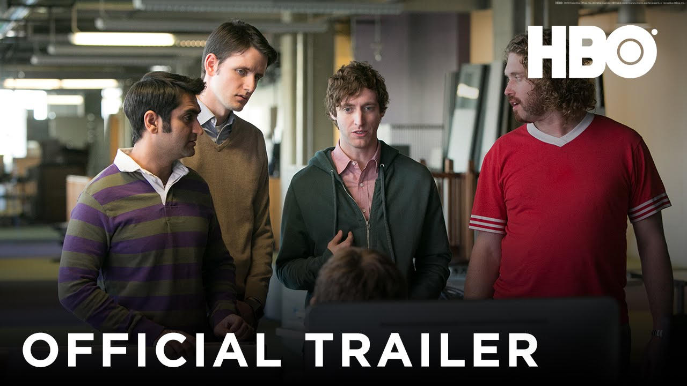

Silicon Valley is a critically acclaimed HBO comedy series (2014-2019) created by Mike Judge that parodies the tech boom. It follows Richard Hendricks, an introverted programmer, and his friends as they struggle to launch a startup called Pied Piper while navigating, and often failing at, the ruthless, cutthroat culture of Silicon Valley.

* Language: en, de
* Type: TV Series
* Category: Hollywood style
* Tags: Startups, Comedy, Satire, Tech Industry
* IMDb rating: [8.5 / 10 (183,146 votes)](https://www.imdb.com/title/tt2575988/)
* Watch on: [Amazon Prime Video](https://www.amazon.de/gp/video/detail/amzn1.dv.gti.4cd6c5b9-d3e2-4c54-af1b-a73875c38357) | [Apple TV](https://tv.apple.com/de/season/season-1/umc.cmc.2e1pibwq8h4w470jrt2j5aw01?showId=umc.cmc.4v7y09m6sa22lpe3bqomh27a) | [YouTube](https://www.youtube.com/show/SC2L5QE7tgqHgriBrZQBfT4g)
----
<h3 id="the-billion-dollar-code">The Billion Dollar Code</h3>

No one knows this story. In Berlin in the 90s, two friends, Carsten and Juri, create Terra Vision, something that seemed impossible at the time - the precursor to Google Earth. 25 years later, the German computer nerds are facing the global corporation in court. The Billion Dollar Code, based on a true story.

* Language: en, de
* Type: TV Series
* Category: Hollywood style
* Tags: Startups, History, Patents, Open Source
* Watch on: [Netflix](https://www.netflix.com/title/81074012)
----
<h3 id="the-it-crowd">The IT Crowd</h3>

Moss and Roy, two computer experts, eke out a miserable existence in the basement of Reynholm Industries. Their colleagues hold them in low regard, so they&#39;ve grown quite gruff in their dealings with others. It isn&#39;t until they get a new boss, Jen, that their daily lives start to pick up again. Is this attractive young woman the key to helping these two nerds escape their obscurity?

* Language: en, de
* Type: TV Series
* Category: Hollywood style
* Tags: Comedy, Workplace, Sitcom, British
* IMDb rating: [8.5 / 10 (176,881 votes)](https://www.imdb.com/title/tt0487831/)
* Watch on: [Amazon Prime Video](https://www.amazon.de/gp/video/detail/B00IB0EEG2/) | [Apple TV](https://tv.apple.com/de/season/season-1/umc.cmc.6eshvcv6fxiwz658zv0krognk?showId=umc.cmc.14z35ywo1dbp5e81sh0yj6520)
----

## Documentaries

<h3 id="alphago-the-movie">AlphaGo - The Movie</h3>

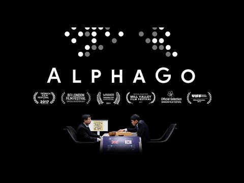

With more board configurations than there are atoms in the universe, the ancient Chinese game of Go has long been considered a grand challenge for artificial intelligence. This film follows DeepMind&#39;s AlphaGo as it takes on legendary Go champion Lee Sedol in a five-game match in Seoul.

* Duration: ca. 1 h 30 min.
* Language: en
* Type: Documentary
* Category: Culture / Society
* Tags: AI, Machine Learning, DeepMind, Games
* IMDb rating: [7.8 / 10 (7,696 votes)](https://www.imdb.com/title/tt6700846/)
* YouTube likes: 329,684
* Watch on: [YouTube](https://www.youtube.com/watch?v=WXuK6gekU1Y)
----
<h3 id="angular-the-documentary">Angular: The Documentary</h3>

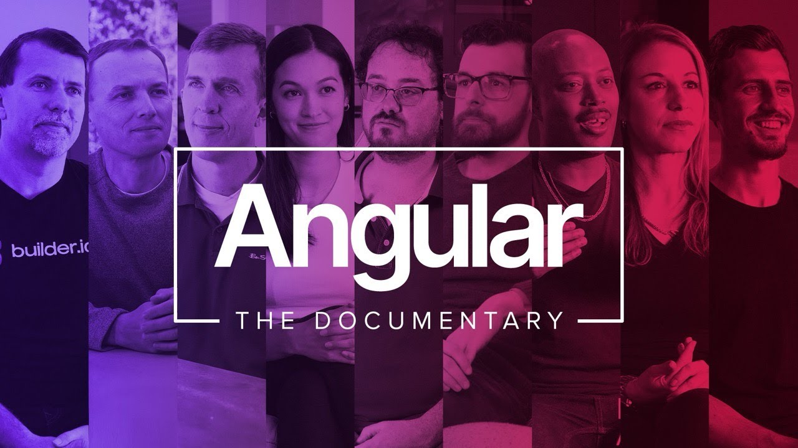

Born as an internal Google experiment - and initially brushed off by Gmail and Google Maps - AngularJS soon became a JavaScript sensation. But when internal pressures pushed the team towards a radical overhaul of the framework, the community felt left behind. What followed was years of attempts to bring Angular back to its former glory without breaking the world again.

Once considered dead and buried, Angular is back on everyone’s lips, pushing the boundaries of JavaScript and reaching new levels of importance at Google.

From Angular 2 to Ivy, incorporating Signals to converging with Wiz and ...

* Duration: ca. 1 h 1 min.
* Language: en
* Type: Documentary
* Category: Applications / Frameworks / Systems
* Tags: Frontend, JavaScript, Google, Open Source, History
* YouTube likes: 3,581
* Watch on: [YouTube](https://www.youtube.com/watch?v=cRC9DlH45lA)
----
<h3 id="app-the-human-story">App: The Human Story</h3>

A revealing look at the forces behind the screen that have made mobile devices into a paradigm-shifting phenomenon - the developers, designers, and dreamers who turned the App Store into a cultural and economic force.

* Type: Documentary
* Category: Culture / People
* Tags: Mobile, App Store, Indie, Software Development
* IMDb rating: [1.2 / 10 (37,490 votes)](https://www.imdb.com/title/tt6038600/)
* Watch on: [Amazon Prime Video](https://www.primevideo.com/-/de/detail/0JYKQR8R1TDGMZGKZVLH13HP8E)
----
<h3 id="atari-game-over">ATARI: Game Over</h3>

A crew search for all of the old Atari 2600 game cartridges of &#34;E.T. the Extra-Terrestrial&#34; that were tossed into a landfill in the 1980s.

* Duration: ca. 1 h 3 min.
* Language: de
* Type: Documentary
* Category: Culture / Society
* Tags: Gaming, History, Atari, Hardware
* IMDb rating: [6.7 / 10 (6,252 votes)](https://www.imdb.com/title/tt3715406/)
* YouTube likes: 25
* Watch on: [Amazon Prime Video](https://www.amazon.de/gp/video/detail/amzn1.dv.gti.d85059f3-e120-421e-9125-adfd5e48f0a1) | [Apple TV](https://tv.apple.com/de/movie/atari-game-over/umc.cmc.3xa62786lun35w67960lp2a25) | [YouTube](https://www.youtube.com/watch?v=84rx7-jCdAY)
----
<h3 id="bbs-the-documentary">BBS: The Documentary</h3>

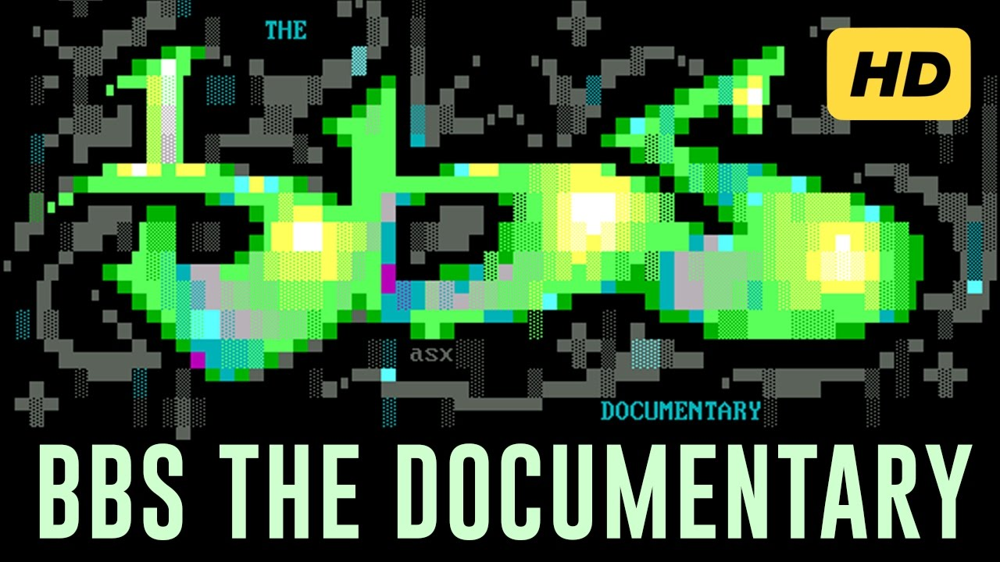

Through eight episodes, director Jason Scott covers the 25 year history of the Dial-Up Bulletin Board System, a modem-connected computer system that let others connect to a computer over a phone line and leave messages and trade files. Containing 200 interviews, episodes mostly consist of elaborate montages of dozens of people composing a narrative.

* Language: en
* Type: Documentary
* Category: Culture / Society
* Tags: Internet History, BBS, Online Communities, Modems
* IMDb rating: [8.4 / 10 (356 votes)](https://www.imdb.com/title/tt0460402/)
* Watch on: [YouTube](https://www.youtube.com/playlist?list=PL7nj3G6Jpv2G6Gp6NvN1kUtQuW8QshBWE)
----
<h3 id="citizenfour">Citizenfour</h3>

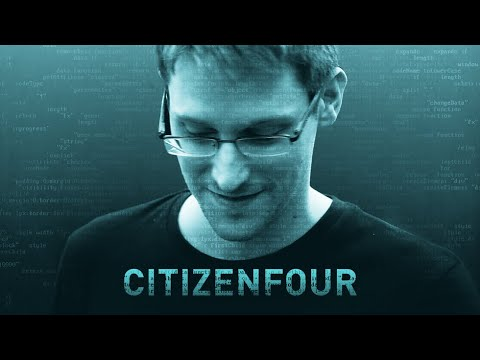

Citizenfour is a real-time thriller, giving audiences an exclusive front-row seat to the moment Edward Snowden changed history with his revelations of widespread government surveillance around the world. In June 2013, filmmaker Laura Poitras and journalist Glenn Greenwald met with Snowden confidentially in Hong Kong, where he handed over classified documents providing evidence of mass indiscriminate and illegal invasions of privacy by the National Security Agency (NSA).

* Language: en, de
* Type: Documentary
* Category: Culture / Society
* Tags: Privacy, Surveillance, Security, Whistleblowing
* IMDb rating: [8.0 / 10 (60,182 votes)](https://www.imdb.com/title/tt4044364/)
* Watch on: [Amazon Prime Video](https://www.amazon.de/gp/video/detail/amzn1.dv.gti.a6a9f6d0-0526-a3e1-5a02-94d192a82cd2) | [RTL&#43;](https://plus.rtl.de/citizenfour-p_252)
----
<h3 id="clojure-the-documentary">Clojure: The Documentary</h3>

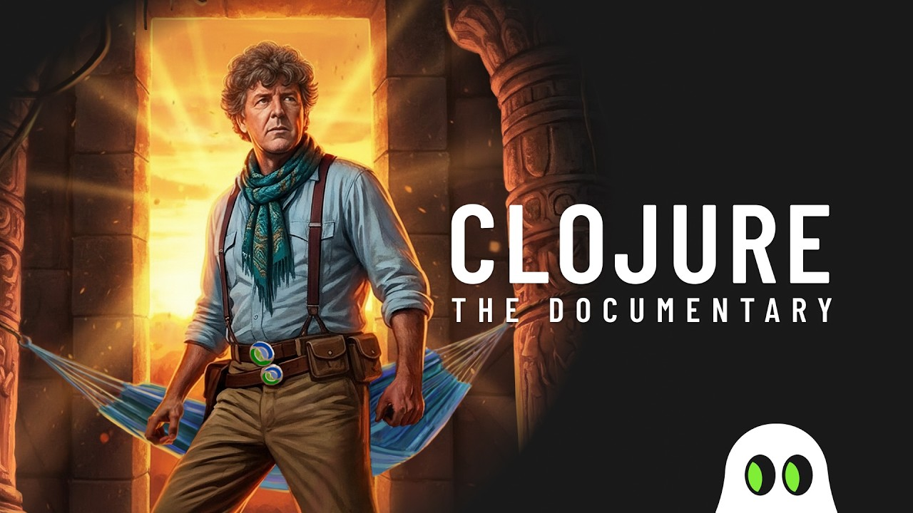

This is the story of how one programmer&#39;s obsession with simplicity quietly reshaped how the software world thinks about time, immutability, and what it means to write code that lasts. From a sabbatical pet-project to the backbone of one of the world&#39;s largest fintechs and a global community that treats their language like a philosophy. This is the story of Clojure. 

---

This documentary wouldn&#39;t exist without the kind support of Nubank: https://building.nubank.com/engineering/

Thanks to Railway, our channel sponsor, for supporting all of our films:
Railway is the all-in-one intelligent cloud ...

* Duration: ca. 1 h 6 min.
* Language: en
* Type: Documentary
* Category: Programming Languages
* Tags: Programming Languages, Functional Programming, Open Source, History
* YouTube likes: 4,601
* Watch on: [YouTube](https://www.youtube.com/watch?v=Y24vK_QDLFg)
----
<h3 id="code-debugging-the-gender-gap">CODE: Debugging the Gender Gap</h3>

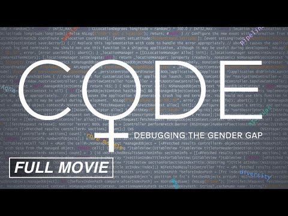

CODE exposes the dearth of female and minority software engineers, explores the reasons for this gap and highlights breakthrough efforts that are producing more diverse programmers while showing how this critical gap can be closed.

Tech jobs are growing three times faster than our colleges are producing computer science graduates. By 2020, there will be over one million unfilled software engineering jobs in the USA. Through compelling interviews, artistic animation and clever flashpoints in popular culture, CODE examines the reasons why more girls and people of color are not seeking opportunities ...

* Duration: ca. 1 h 19 min.
* Language: en
* Type: Documentary
* Category: Culture / Society
* Tags: Girls, STEM, Women in Tech
* IMDb rating: [6.2 / 10 (337 votes)](https://www.imdb.com/title/tt4335520/)
* YouTube likes: 58
* Watch on: [YouTube](https://www.youtube.com/watch?v=rQKRw6tWsb8)
----
<h3 id="coded-bias">Coded Bias</h3>

When MIT Media Lab researcher Joy Buolamwini discovers that facial recognition does not see dark-skinned faces accurately, she embarks on a journey to push for the first-ever U.S. legislation against bias in algorithms that impact us all.

* Language: en, de
* Type: Documentary
* Category: Culture / Society
* Tags: AI, Algorithmic Bias, Privacy, Society
* IMDb rating: [6.8 / 10 (2,930 votes)](https://www.imdb.com/title/tt11394170/)
* Watch on: [Amazon Prime Video](https://www.primevideo.com/-/de/detail/0GLUAOADBR7IWUD0NZPU7JFI11) | [Netflix](https://www.netflix.com/title/81328723)
----
<h3 id="countdown-inspiration4-mission-to-space">Countdown: Inspiration4 Mission to Space</h3>

A trailblazing mission captured in near-real time as four crew members make history in the first all-civilian mission into orbit.

* Language: en, de
* Type: Documentary
* Category: Culture / People
* Tags: Space, SpaceX, Engineering, History
* Watch on: [Netflix](https://www.netflix.com/title/81441273)
----
<h3 id="deep-web">Deep Web</h3>

A feature documentary that explores the rise of a new Internet; decentralized, encrypted, dangerous and beyond the law; with particular focus on the FBI capture of the Tor hidden service Silk Road, and the judicial aftermath.

* Duration: ca. 1 h 26 min.
* Language: en, de
* Type: Documentary
* Category: Culture / Society
* Tags: Security, Tor, Cryptocurrency, Society
* IMDb rating: [6.9 / 10 (9,902 votes)](https://www.imdb.com/title/tt3312868/)
* YouTube likes: 108
* Watch on: [Amazon Prime Video](https://www.amazon.de/gp/video/detail/amzn1.dv.gti.08b3c0a6-d2f2-65d1-a49d-4063ffe2d328) | [YouTube](https://www.youtube.com/watch?v=w4P-eW0UdKo)
----
<h3 id="defcon-the-documentary">DEFCON: The Documentary</h3>

A film about the world&#39;s largest hacking convention and its 20th year running. Filmed over the summer of 2012 and containing hundreds of hours of interviews, parties, presentations and spectacle. Over 280 hours of footage was recorded in support of the documentary, and five separate camera crews were in action.

* Duration: ca. 1 h 51 min.
* Language: en
* Type: Documentary
* Category: Culture / Society
* Tags: Hacking, Security, Conferences, Community
* IMDb rating: [5.8 / 10 (518 votes)](https://www.imdb.com/title/tt3010462/)
* YouTube likes: 7,918
* Watch on: [YouTube](https://www.youtube.com/watch?v=3ctQOmjQyYg)
----
<h3 id="ebpf-unlocking-the-kernel">eBPF: Unlocking the Kernel</h3>

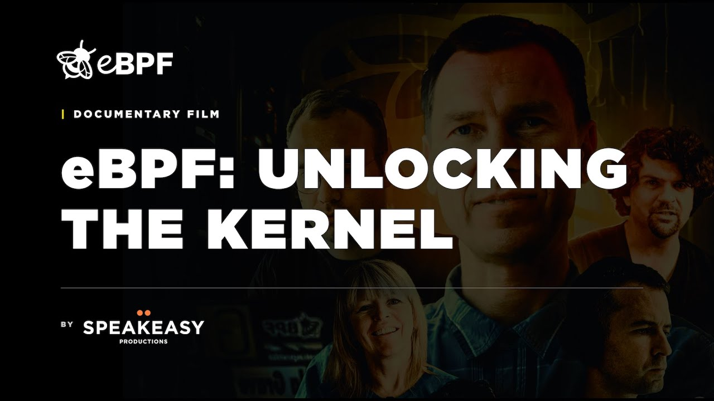

The official eBPF documentary.

In 2014, a group of engineers at Plumgrid needed to find an innovative and cost-effective solution to handle network traffic in SDN environments. What they created was a landmark in the industry known as the extended Berkeley Packet Filter (or eBPF). This vital technology allows user-level code execution inside the Linux Kernel, transforming network traffic handling for SDN environments. Whether these engineers knew it or not, they had just revolutionized the Linux Kernel. We go in-depth to explore the origins of eBPF and showcase the stories, challenges, and rewards ...

* Duration: ca. 30 min.
* Language: en
* Type: Documentary
* Category: Applications / Frameworks / Systems
* Tags: Linux, Kernel, Open Source, Networking
* YouTube likes: 4,925
* Watch on: [YouTube](https://www.youtube.com/watch?v=Wb_vD3XZYOA)
----
<h3 id="elixir-the-documentary">Elixir: The Documentary</h3>

Get ready to explore the origins of the #Elixir programming language, the manner in which it handles concurrency and the speed with which it has grown since its creation back in 2011.

Featuring José Valim, creator of Elixir, and several other big names from the Elixir community, including Justin Schneck, co-author of the Nerves Project, and Chris McCord, the creator of the Phoenix Framework, this documentary highlights the power of open-source development and the role of Elixir in enabling developers to achieve things that were impossible, or prohibitively expensive, to do before.

Check out the ...

* Duration: ca. 13 min.
* Language: en
* Type: Documentary
* Category: Programming Languages
* Tags: Programming Languages, Functional Programming, Open Source, History
* YouTube likes: 8,111
* Watch on: [YouTube](https://www.youtube.com/watch?v=lxYFOM3UJzo)
----
<h3 id="ember-js-the-documentary">Ember.js: The Documentary</h3>

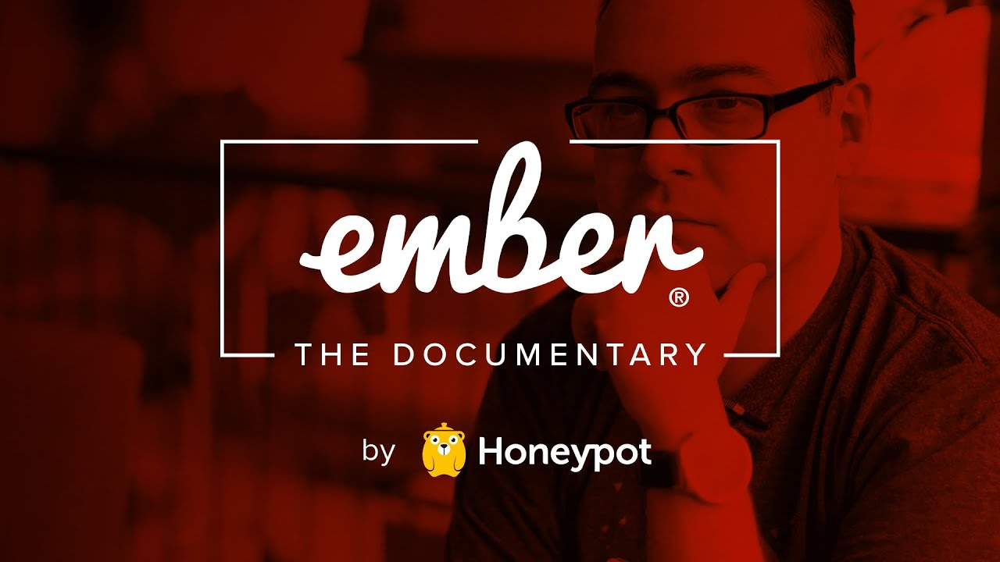

Starring Yehuda Katz and Tom Dale  (co-creators of Ember.js), as well as many other big names from the #Ember community, &#34;Ember.js: The Documentary&#34; explores why and how #Emberjs came to be, the pioneers behind its creation and the life-altering decisions that go into making #opensource software.

Check out the home for untold developer stories around open source, careers and all the other cool stuff developers are doing at https://bit.ly/3xiIzQA

Learn more about Honeypot: https://www.honeypot.io/?utm_source=youtube

Follow us!
Twitter: https://twitter.com/honeypotio
Facebook: https://www.facebook. ...

* Duration: ca. 25 min.
* Language: en
* Type: Documentary
* Category: Applications / Frameworks / Systems
* Tags: Frontend, JavaScript, Open Source, History
* YouTube likes: 2,454
* Watch on: [YouTube](https://www.youtube.com/watch?v=Cvz-9ccflKQ)
----
<h3 id="free-to-play">Free to Play</h3>

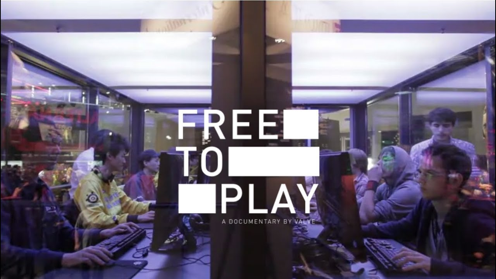

Three professional gamers from different parts of the world fight personal hardship to compete in the first Dota 2 International tournament with a million-dollar grand prize. A Valve-produced documentary chronicling the rise of competitive eSports.

* Duration: ca. 1 h 16 min.
* Language: en
* Type: Documentary
* Category: Culture / People
* Tags: Gaming, eSports, Dota 2, Valve
* IMDb rating: [7.6 / 10 (13,734 votes)](https://www.imdb.com/title/tt3203290/)
* YouTube likes: 115,192
* Watch on: [Apple TV](https://tv.apple.com/de/movie/free-to-play/umc.cmc.3ti8vrr7ooltzqkij17ovd4xx) | [Netflix](https://www.netflix.com/title/81438157) | [YouTube](https://www.youtube.com/watch?v=UjZYMI1zB9s)
----
<h3 id="general-magic">General Magic</h3>

The story of the most influential Silicon Valley startup nobody has ever heard of. General Magic spun out of Apple in 1990 to create the precursor of the smartphone, but the world wasn&#39;t ready - the fame and fortune went to others years later with similar products.

* Duration: ca. 1 h 33 min.
* Language: en, de
* Type: Documentary
* Category: Culture / People
* Tags: Apple, Startups, History, Silicon Valley
* IMDb rating: [7.4 / 10 (1,354 votes)](https://www.imdb.com/title/tt6849786/)
* YouTube likes: 232
* Watch on: [YouTube](https://www.youtube.com/watch?v=tuFl4WEXBrk)
----
<h3 id="good-copy-bad-copy">Good Copy Bad Copy</h3>

A documentary about the current state of copyright and culture, is a documentary about copyright and culture in the context of Internet, peer-to-peer file sharing and other technological advances, directed by Andreas Johnsen, Ralf Christensen, and Henrik Moltke.

* Duration: ca. 59 min.
* Language: en
* Type: Documentary
* Category: Culture / Society
* Tags: Copyright, File Sharing, Internet Culture, Remix
* IMDb rating: [7.0 / 10 (206 votes)](https://www.imdb.com/title/tt1782451/)
* YouTube likes: 449
* Watch on: [YouTube](https://www.youtube.com/watch?v=ByY6j0qzOyM)
----
<h3 id="google-and-the-world-brain">Google and the World Brain</h3>

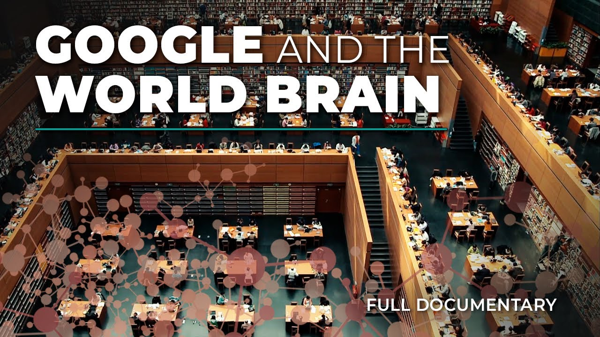

The most ambitious project ever conceived on the Internet - Google&#39;s effort to scan every book in the world - sparked an unprecedented backlash from writers, publishers, librarians and policy makers around the globe. The documentary tells the story of the secret pact, the worldwide revolt, and the future of the world&#39;s knowledge.

* Duration: ca. 1 h 29 min.
* Language: en
* Type: Documentary
* Category: Culture / Society
* Tags: Google, Copyright, Internet, Society
* IMDb rating: [6.7 / 10 (967 votes)](https://www.imdb.com/title/tt2551516/)
* YouTube likes: 36
* Watch on: [YouTube](https://www.youtube.com/watch?v=gIUa4FkGaq4)
----
<h3 id="graphql-the-documentary">GraphQL: The Documentary</h3>

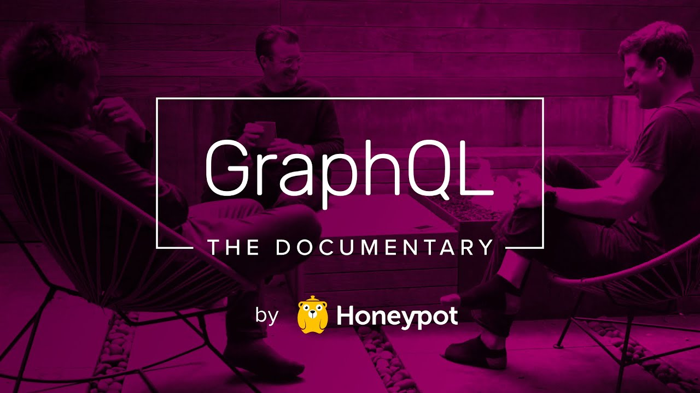

The GraphQL Documentary 🚀🚀🚀 Starring Lee Byron, Dan Schafer and Nick Schrock  (co-creators of GraphQL) and other big names from the #GraphQL community, &#34;GraphQL: The Documentary&#34; explores the story of why and how GraphQL came to be and the impact it&#39;s having on big #tech companies worldwide, including Facebook, Twitter, Airbnb and Github.

Check out the home for untold developer stories around open source, careers and all the other cool stuff developers are doing at https://bit.ly/3nQNpBo

&#34;We have been really involved with the GraphQL community since founding Honeypot. We run the GraphQL Conf ...

* Duration: ca. 28 min.
* Language: en
* Type: Documentary
* Category: Applications / Frameworks / Systems
* Tags: API, Open Source, History
* YouTube likes: 15,215
* Watch on: [YouTube](https://www.youtube.com/watch?v=783ccP__No8)
----
<h3 id="half-life-25th-anniversary-documentary">Half-Life: 25th Anniversary Documentary</h3>

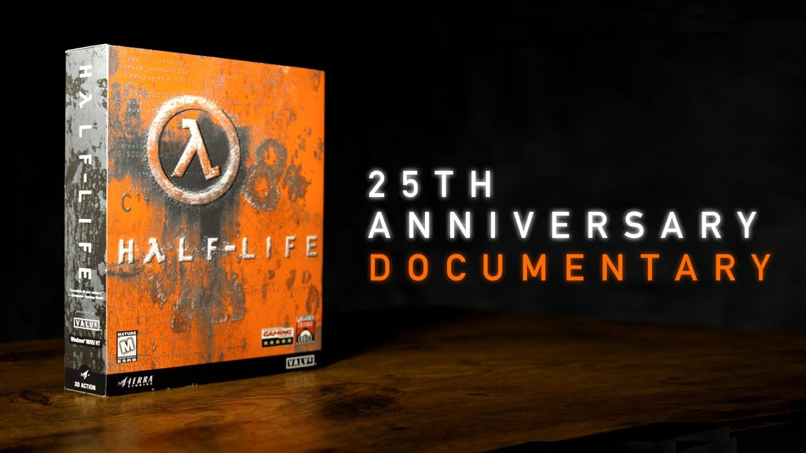

To celebrate the 25th Anniversary of the release of Half-Life we reunited the original development team to share their memories of creating Valve&#39;s first game.

Check out the Half-Life 25th Anniversary Update, restored content, new multiplayer maps, and a bunch of quality of life updates for the original game at http://half-life.com/halflife25

0:00 - Intro
1:33 - Early Days of Valve
8:29 - Technology &amp; Scripted Sequences
17:06 - Character Design
30:14 - Creating the Opening Levels
37:09 - Weapon Design
39:46 - Sound Design
44:08 - Level Design
51:05 - Narrative &amp; Voice Acting
57:48 - Xen 
01:01:12 ...

* Duration: ca. 1 h 5 min.
* Language: en
* Type: Documentary
* Category: Culture / People
* Tags: Game Development, Valve, History
* IMDb rating: [7.5 / 10 (260 votes)](https://www.imdb.com/title/tt30060427/)
* YouTube likes: 281,603
* Watch on: [YouTube](https://www.youtube.com/watch?v=TbZ3HzvFEto)
----
<h3 id="i-am-human-a-documentary-about-real-life-cyborgs">I Am Human: A Documentary About Real-Life Cyborgs</h3>

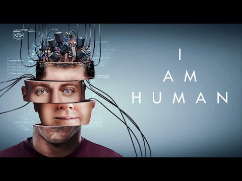

I Am Human (2019) is a documentary exploring the lives of three individuals - Bill, Anne, and Stephen - who become some of the first &#34;real-life cyborgs&#34; through experimental brain implant technology. Directed by Elena Gaby and Taryn Southern, it examines the personal, ethical, and societal implications of merging human consciousness with machines to treat paralysis, Parkinson&#39;s, and blindness.

* Type: Documentary
* Category: Culture / Society
* Tags: Hardware, Brain-Computer Interface, Health Tech, Ethics
* IMDb rating: [6.6 / 10 (394,003 votes)](https://www.imdb.com/title/tt9114286/)
* Watch on: [Amazon Prime Video](https://www.primevideo.com/-/es/detail/0MN9YN2HGYGM3QOUBQV2MQNX0F)
----
<h3 id="indie-game-the-movie">Indie Game: The Movie</h3>

Go behind the scenes of the independent video game industry as this documentary follows the journey of passionate developers striving to create their own unique games. Through intimate interviews and gripping storytelling, &#34;Indie Game: The Movie&#34; reveals the struggles, triumphs, and sacrifices these developers make in pursuit of their dreams, offering an inspiring glimpse into the world of indie game development.

* Type: Documentary
* Category: Culture / People
* Tags: Game Development, Indie Games, Software Engineering
* IMDb rating: [7.6 / 10 (21,739 votes)](https://www.imdb.com/title/tt1942884/)
* Watch on: [Netflix](https://www.netflix.com/title/70229918)
----
<h3 id="insert-coin">Insert Coin</h3>

Insert Coin is the behind-the-scenes story of one of the greatest video game studios of all time - Midway Games. Led by the &#34;Godfather of Videogames&#34; Eugene Jarvis, the company pioneered the concept of live action gaming, kickstarting a new arcade boom and grossing billions of dollars in the process with massive hits like Mortal Kombat and NBA Jam. Through intimate and often hilarious interviews with the people who were there, we witness how a small, tight-knit group of friends deal with next level success and the roller coaster ride that comes with it.

* Duration: ca. 1 h 42 min.
* Language: en, de
* Type: Documentary
* Category: Culture / People
* Tags: Gaming, Arcade, History, Midway
* YouTube likes: 6,499
* Watch on: [Amazon Prime Video](https://www.primevideo.com/-/de/detail/Insert-Coin/0SP3M4H5YLMETO27UKMKDBP7SY) | [YouTube](https://www.youtube.com/watch?v=7zx5GunyUS4)
----
<h3 id="inside-bills-brain-decoding-bill-gates">Inside Bill&#39;s Brain: Decoding Bill Gates</h3>

A documentary that tells Bill Gates&#39; life story as he pursues solutions to some of the world&#39;s most complex problems.

* Language: en, de
* Type: Documentary
* Category: Culture / People
* Tags: Microsoft, Bill Gates, History, Philanthropy
* Watch on: [Netflix](https://www.netflix.com/title/80184771)
----
<h3 id="inside-envoy-the-proxy-for-the-future">Inside Envoy: The Proxy for the Future</h3>

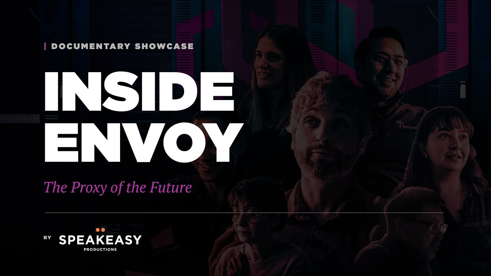

Inside Envoy is a new documentary for anyone interested in how open source technology works behind the scenes to shape our future.

Inside Envoy: the Proxy for the Future gives viewers an inside look at the journey from creation to mass adoption of the insanely popular open source Envoy project, one of the most useful open source projects in the world today.

Envoy was open sourced in the fall of 2016 and quickly gained adoption. In 2017, Envoy joined the Cloud Native Computing Foundation (CNCF). Today, Envoy serves trillions of daily requests and has been adopted by thousands of organizations ...

* Duration: ca. 32 min.
* Language: en
* Type: Documentary
* Category: Applications / Frameworks / Systems
* Tags: Networking, Service Mesh, Open Source, Cloud Native
* YouTube likes: 578
* Watch on: [YouTube](https://www.youtube.com/watch?v=uaksVVHDhYU)
----
<h3 id="intellij-idea-the-documentary">IntelliJ IDEA: The Documentary</h3>

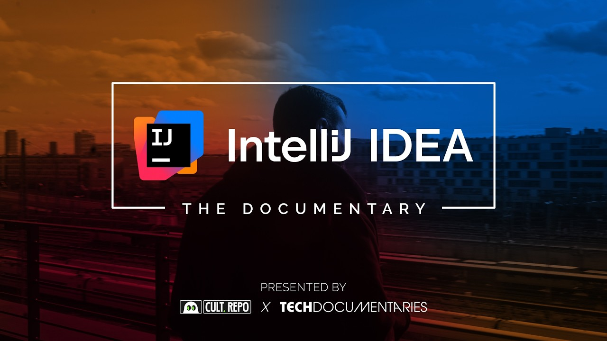

This is the IDE that changed everything.

This documentary traces the 25-year journey of one of the most beloved tools in software development. Through rare archival footage, intimate interviews, and behind-the-scenes moments, it explores how IntelliJ IDEA challenged the status quo, shaped the Java world, and set the standard for intelligent tooling, all while staying true to its founding vision: helping developers do their best work.

Featuring stories from JetBrains creators, current engineers, and voices from Google, Oracle, and the Spring community.

Producer: Guillermo López
Director: Jaś ...

* Duration: ca. 39 min.
* Language: en
* Type: Documentary
* Category: Applications / Frameworks / Systems
* Tags: Developer Tools, IDE, JetBrains, History
* YouTube likes: 1,688
* Watch on: [YouTube](https://www.youtube.com/watch?v=Kourq_Lz03U)
----
<h3 id="internet-relay-chat-irc">Internet Relay Chat (IRC)</h3>

Our love letter to Internet Relay Chat.

Want more content like this? Support our mission! Send us a Super Thanks and check out our Patreon &#43; Discord community:  https://www.patreon.com/serialport

Got some retro gear you want to donate? Get in touch with us at serialport.org.

Our second channel: @TheParallelPort 

#internet #chat

00:00 — Source code
00:59 — Why IRC?
04:27 — Because It&#39;s Time Network
08:32 — Alku
11:40 — Trillian
16:00 — The splits
22:14 — The legacy of IRC
25:07 — Something special

References and sources: https://docs.google.com/document/d/e/2PACX-1vQjGmdjmESDJP7dy6S5f2iXossxO1tfI-oHszpZrzfbnJvB3lPNscTtUVj43hf4HEzJVU6EbVlKwy8P/pub

* Duration: ca. 26 min.
* Language: en
* Type: Documentary
* Category: Applications / Frameworks / Systems
* Tags: Networking, Chat, Open Source, History
* YouTube likes: 15,446
* Watch on: [YouTube](https://www.youtube.com/watch?v=6UbKenFipjo)
----
<h3 id="investors-a-master-class">INVESTORS: A Master Class</h3>

A unique master class in which we explore the people and money behind some of Europe’s tech unicorns such as Spotify and Zalando. 
We ask these successful investors and founders questions like: 
What makes a billion dollar idea? When is the right time to raise Venture Capital? What makes a great founding team? How to talk to a VC? What does a great pitch deck look like? 
What does the future of the tech industry look like? 

You’ll hear from the following investors and founders:
Emma Tracey – Co-Founder &amp; Ex CEO of Honeypot and Angel Investor
Claude Ritter – Co-Founder &amp; Managing Partner of Cavalry ...

* Duration: ca. 30 min.
* Language: en
* Type: Documentary
* Category: Culture / Society
* Tags: Startups, Fundraising, Venture Capital
* YouTube likes: 742
* Watch on: [YouTube](https://www.youtube.com/watch?v=M8pZesH0jsE)
----
<h3 id="kill-chain-the-cyber-war-on-americas-elections">Kill Chain: The Cyber War on America&#39;s Elections</h3>

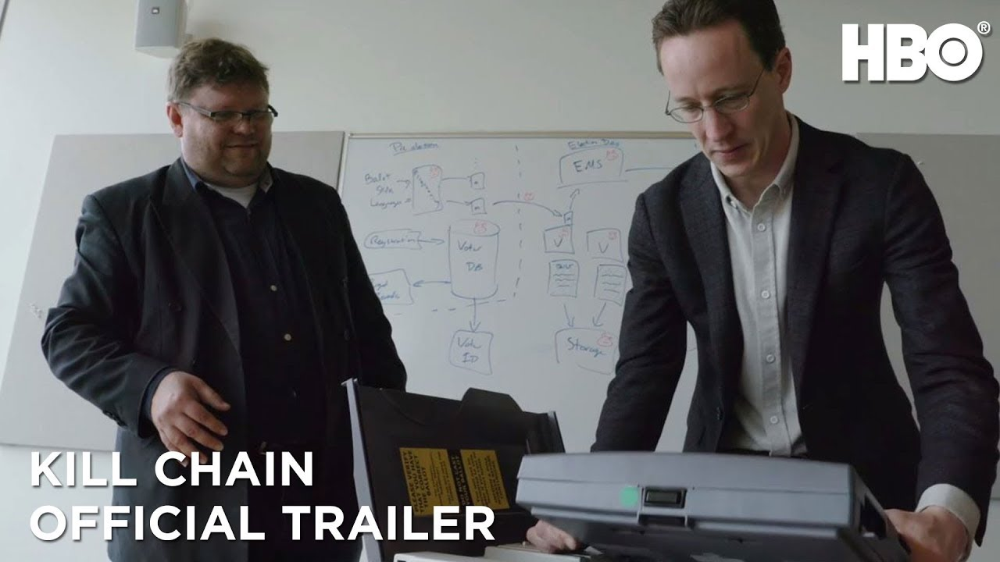

Finnish hacker and election expert Harri Hursti investigates election-related hacks, uncovering just how unprotected voting systems really are.

* Type: Documentary
* Category: Culture / Society
* Tags: Security, Elections, Hacking, Politics
* Watch on: [Amazon Prime Video](https://www.primevideo.com/-/de/detail/0HJLOZ49TEBBAPIZEJI2PDWGC1/) | [HBO Max](https://www.hbomax.com/tr/en/movies/kill-chain-the-cyber-war-on-americas-elections/f8e375c7-3758-4570-b8a4-3e938db44898)
----
<h3 id="kubernetes-the-documentary-part-1">Kubernetes: The Documentary [PART 1]</h3>

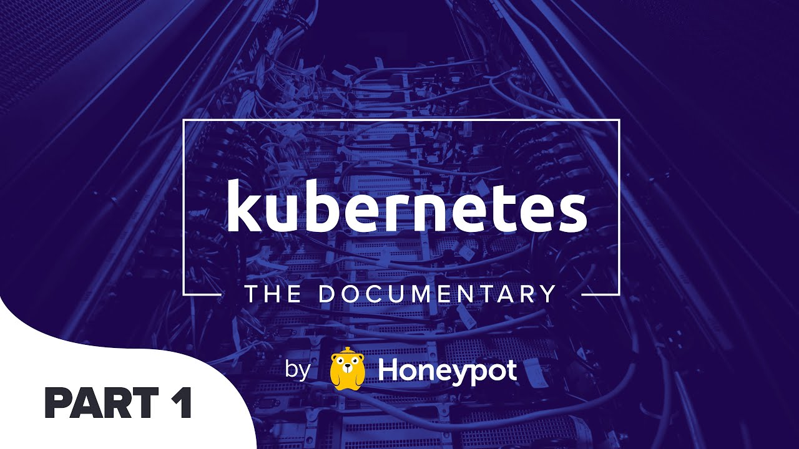

The official Kubernetes Documentary Part 1. 

Inspired by the open source success of Docker in 2013 and seeing the need for innovation in the area of large-scale cloud computing, a handful of forward-thinking Google engineers set to work on the container orchestrator that would come to be known as Kubernetes– this new tool would forever change the way the internet is built.

These engineers overcome technical challenges, resistance to open source from within, naysayers, and intense competition from other big players in the industry.

Most engineers know about “The Container Orchestrator Wars’’ ...

* Duration: ca. 25 min.
* Language: en
* Type: Documentary
* Category: Applications / Frameworks / Systems
* Tags: Cloud Native, Orchestration, Open Source, History
* YouTube likes: 12,739
* Watch on: [YouTube](https://www.youtube.com/watch?v=BE77h7dmoQU)
----
<h3 id="kubernetes-the-documentary-part-2">Kubernetes: The Documentary [PART 2]</h3>

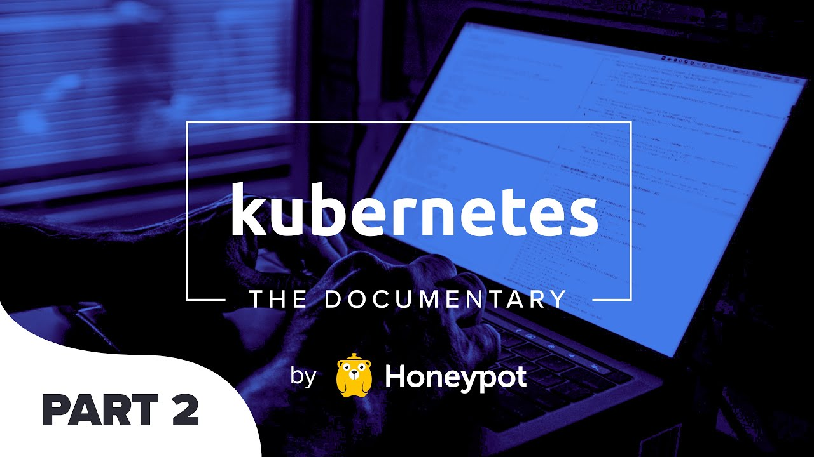

The official Kubernetes Documentary Part 2. 

Inspired by the open source success of Docker in 2013 and seeing the need for innovation in the area of large-scale cloud computing, a handful of forward-thinking Google engineers set to work on the container orchestrator that would come to be known as Kubernetes– this new tool would forever change the way the internet is built.

These engineers overcome technical challenges, resistance to open source from within, naysayers, and intense competition from other big players in the industry.

Most engineers know about “The Container Orchestrator Wars’’ ...

* Duration: ca. 31 min.
* Language: en
* Type: Documentary
* Category: Applications / Frameworks / Systems
* Tags: Cloud Native, Orchestration, Open Source, History
* YouTube likes: 5,993
* Watch on: [YouTube](https://www.youtube.com/watch?v=318elIq37PE)
----
<h3 id="laravel-origins-a-php-documentary">Laravel Origins: A PHP Documentary</h3>

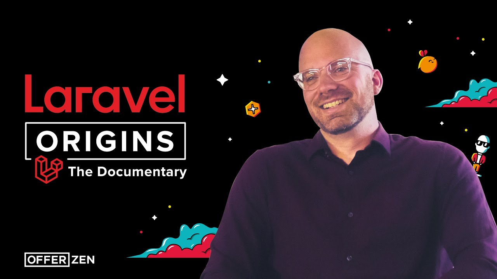

🎥 More tech documentaries coming out soon, subscribe to be notified 👉
👕 Get your Laravel Origins swag: https://bit.ly/laravel-swag

Featuring Laravel creator Taylor Otwell and many others who’ve contributed to making Laravel the technology and community that it is today, Laravel Origins tells the story of why Laravel came to be, how it&#39;s grown over the last 10 years and what the future may hold for Taylor and the wider Laravel community.

Laravel Origins was filmed in late 2021, produced by OfferZen and directed by Dewald Brand, with shoots in the USA, Canada, the UK, Australia, Portugal, Belgium, ...

* Duration: ca. 33 min.
* Language: en
* Type: Documentary
* Category: Applications / Frameworks / Systems
* Tags: Web Frameworks, PHP, Open Source, History
* YouTube likes: 6,786
* Watch on: [YouTube](https://www.youtube.com/watch?v=127ng7botO4)
----
<h3 id="lo-and-behold-reveries-of-the-connected-world">Lo and Behold: Reveries of the Connected World</h3>

Directed by Werner Herzog, this documentary explores the history, impact, and potential future of the internet. The film features interviews with pioneers of the tech industry and provides thought-provoking insights into the digital revolution.

* Duration: ca. 1 h 38 min.
* Language: en
* Type: Documentary
* Category: Culture / Society
* Tags: Internet, History, Society
* IMDb rating: [7.0 / 10 (13,906 votes)](https://www.imdb.com/title/tt5275828/)
* YouTube likes: 5,756
* Watch on: [YouTube](https://www.youtube.com/watch?v=q3g3hqNJqpQ)
----
<h3 id="local-first-software-taking-back-control-of-our-data">Local-First Software: Taking Back Control of Our Data</h3>

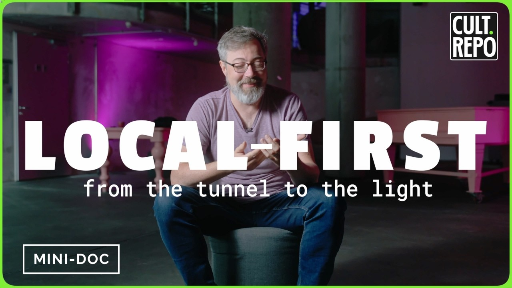

Most modern software assumes your data lives in the cloud. As long as you’re online, everything works. When you’re not, it often doesn’t.

Local-First software starts from a different idea - that your data should live on your device: fast, responsive, and available whether you have an internet connection or not.

In this mini-documentary, we talk to the builders and early-adopters of Local-First software about why it emerged, and what it changes about how applications are built. From synchronisation and conflict-free data types to privacy, encryption, and real-time collaboration, local-first represents ...

* Duration: ca. 11 min.
* Language: en
* Type: Documentary
* Category: Applications / Frameworks / Systems
* Tags: Local-First, Distributed Systems, Data, Open Source
* YouTube likes: 4,649
* Watch on: [YouTube](https://www.youtube.com/watch?v=10d8HxS4y_g)
----
<h3 id="minecraft-the-story-of-mojang">Minecraft: The Story of Mojang</h3>

Since its development in 2009, Minecraft has taken the digital world by storm. It&#39;s now played by millions of people on a global scale. With exclusive interviews from YouTube celebrities and industry experts, this documentary takes an in-depth look at how one game took over the gaming world and follows the story of Mojang, the small Swedish studio behind it.

* Duration: ca. 1 h 44 min.
* Language: en
* Type: Documentary
* Category: Culture / People
* Tags: Gaming, Minecraft, Indie, History
* YouTube likes: 1,517
* Watch on: [YouTube](https://www.youtube.com/watch?v=ggCIGOQloY4)
----
<h3 id="node-js-the-documentary">Node.js: The Documentary</h3>

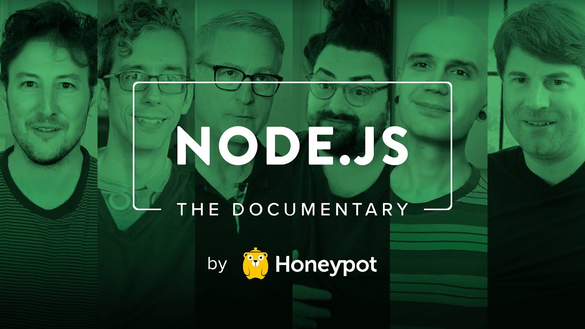

Back in 2008, most people thought of JavaScript as just a client-side language. But when Google&#39;s V8 appeared, young developer Ryan Dahl made the connection between non-blocking servers, V8, and JavaScript. It was by combining these key elements that he was able to create the now hugely popular Node.js.

What young Ryan Dahl probably didn&#39;t expect was how much forking drama would follow.

Join us as we delve into the origins of Node.js, meet some of its earliest contributors and explore the complicated dynamics between corporations using open source technologies and the dedicated community members ...

* Duration: ca. 1 h 3 min.
* Language: en
* Type: Documentary
* Category: Applications / Frameworks / Systems
* Tags: JavaScript, Backend, Open Source, History
* YouTube likes: 24,026
* Watch on: [YouTube](https://www.youtube.com/watch?v=LB8KwiiUGy0)
----
<h3 id="nuxt-js-the-mini-documentary">Nuxt.js: The Mini Documentary</h3>

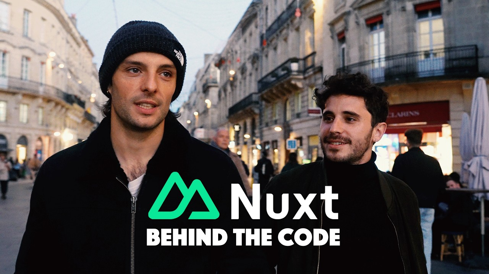

Nuxt is an open source framework that makes web development intuitive and powerful. Create performant and production-grade full-stack web apps and websites with confidence. 

https://nuxt.com/

CHAPTERS:
00:00 Intro 
00:39 Learning about Vue.js
01:41 The inspiration for Nuxt 
02:27 Evan You hears about Nuxt 
03:05 The Honeypot Vue documentary 
03:48 Introduction of Vite 
04:15 The plugin ecosystem around Nuxt 
04:58 The Supabase Plugin for Nuxt
05:44 The pushup challenge that lead to the Supabase plugin 
07:14 Supabase, the ideal backend for Nuxt apps
09:43 What’s next for Vue and Nuxt 
10:45 The ...

* Duration: ca. 12 min.
* Language: en
* Type: Documentary
* Category: Applications / Frameworks / Systems
* Tags: Frontend, JavaScript, Vue.js, Open Source, History
* YouTube likes: 1,154
* Watch on: [YouTube](https://www.youtube.com/watch?v=uvG11I-ftfo)
----
<h3 id="particle-fever">Particle Fever</h3>

As the Large Hadron Collider is about to be launched for the first time, physicists are on the cusp of the greatest scientific discovery of all time - or perhaps their greatest failure.

* Duration: ca. 1 h 39 min.
* Language: en, de
* Type: Documentary
* Category: Culture / Society
* Tags: Science, Physics, CERN, Engineering
* YouTube likes: 28
* Watch on: [Amazon Prime Video](https://www.amazon.de/gp/video/detail/amzn1.dv.gti.d0a9f6bd-4024-e2a9-6abb-567e60e33f6f) | [Netflix](https://www.netflix.com/title/70296323) | [RTL&#43;](https://plus.rtl.de/particle-fever-die-jagd-nach-dem-higgs-p_899) | [YouTube](https://www.youtube.com/watch?v=WWhHlxhNn58)
----
<h3 id="picture-a-scientist">Picture a Scientist</h3>

Despite the minimal news coverage, sexual harassment and gender inequality against women are no less prevalent in science than they are in pop culture and corporate America.

* Language: en, de
* Type: Documentary
* Category: Culture / Society
* Tags: Science, Diversity, Society, Academia
* Watch on: [Amazon Prime Video](https://www.primevideo.com/-/de/detail/Picture-a-Scientist/0R4BAWV31M206XNU7LVNH5Y6VS) | [RTL&#43;](https://plus.rtl.de/picture-a-scientist-frauen-der-wissenschaft-p_1014)
----
<h3 id="print-the-legend">Print the Legend</h3>

Follows the people racing to bring the hot new 3D printing technology to your home, documenting the &#34;Macintosh Moment&#34; of this revolution and exploring what it takes to live the American Dream.

* Type: Documentary
* Category: Culture / People
* Tags: Hardware, 3D Printing, Startups, Maker Culture
* Watch on: [Apple TV](https://tv.apple.com/de/movie/print-the-legend/umc.cmc.4ca9o2wed84i5ptt1fccfu91o) | [Netflix](https://www.netflix.com/title/80005444)
----
<h3 id="prometheus-the-documentary">Prometheus: The Documentary</h3>

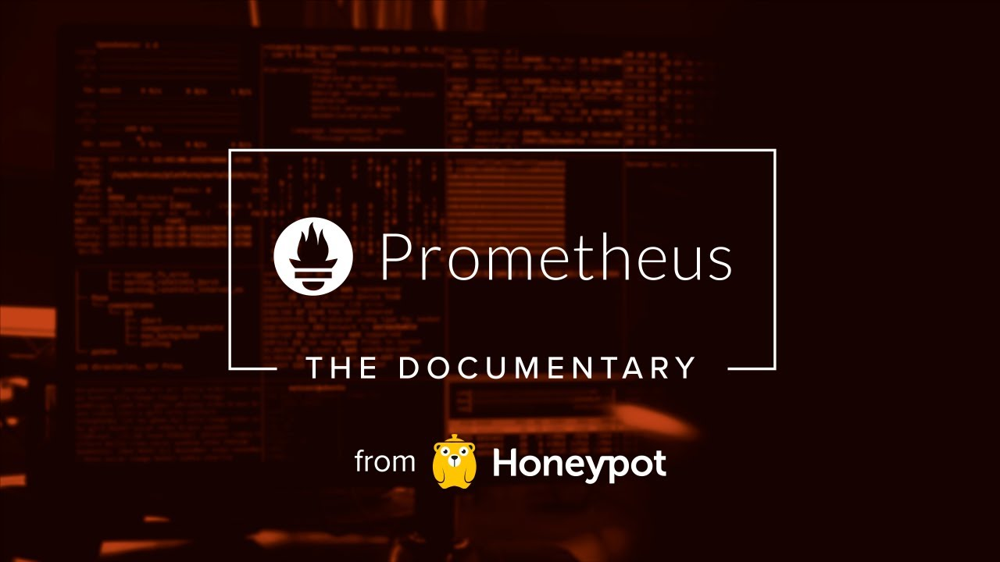

Watch and witness the journey of open-source monitoring system, Prometheus. Before Kubernetes existed—even before Docker—the team at Soundcloud already knew their monitoring system deserved a complete, fundamental revamp. Of course, as with anything in development, this was no easy task.
Join us as we explore the story of Prometheus, from inception to adoption as told by the story’s key players including Julian Volz, Matthias Rampke, Björn Rabenstein, and more. In the end, you’ll see how a “problem to be solved” eventually led the industry to a completely new understanding of monitoring. We hope ...

* Duration: ca. 27 min.
* Language: en
* Type: Documentary
* Category: Applications / Frameworks / Systems
* Tags: Observability, Monitoring, Open Source, Cloud Native, History
* YouTube likes: 3,576
* Watch on: [YouTube](https://www.youtube.com/watch?v=rT4fJNbfe14)
----
<h3 id="python-the-documentary">Python: The Documentary</h3>

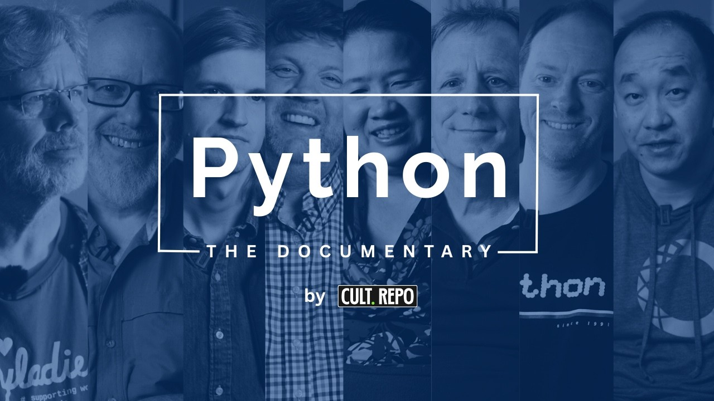

This is the story of the world&#39;s most beloved programming language: Python. What began as a side project in Amsterdam during the 1990s became the software powering artificial intelligence, data science and some of the world’s biggest companies. But Python&#39;s future wasn&#39;t certain; at one point it almost disappeared.

This 90-minute documentary features Guido van Rossum, Travis Oliphant, Barry Warsaw, and many more, and they tell the story of Python’s rise, its community-driven evolution, the conflicts that almost tore it apart, and the language’s impact on... well… everything. 

Thanks to our sponsors ...

* Duration: ca. 1 h 24 min.
* Language: en
* Type: Documentary
* Category: Programming Languages
* Tags: Programming Languages, Open Source, History
* IMDb rating: [8.3 / 10 (12 votes)](https://www.imdb.com/title/tt38589263/)
* YouTube likes: 35,164
* Watch on: [YouTube](https://www.youtube.com/watch?v=GfH4QL4VqJ0)
----
<h3 id="react-js-the-documentary">React.js: The Documentary</h3>

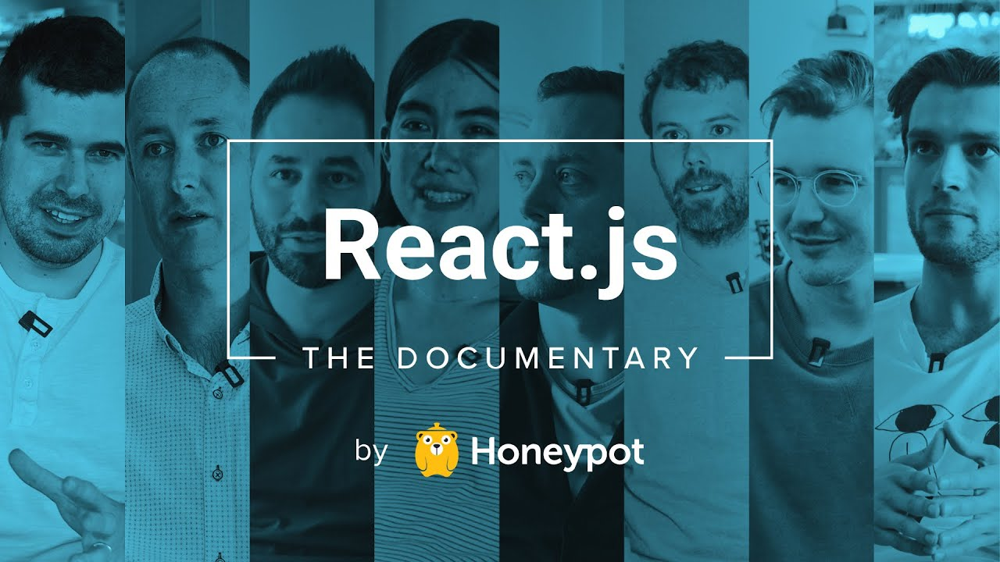

React is easily one of the single most popular libraries in use today. Given that it was made within a juggernaut like Facebook, you might have assumed it was always destined for success.
But what if we told you that React’s first brush with the public sphere was anything but glamorous? React.js: The Documentary brings you the full story behind the early days of React, focusing on the dedicated group of developers who helped bring it to the world stage. This story is told by an all-star cast of developers like Tom Occhino, Christopher Chedeau, Pete Hunt, Sebastian Markbåge, Dan Abramov, and many ...

* Duration: ca. 1 h 18 min.
* Language: en
* Type: Documentary
* Category: Applications / Frameworks / Systems
* Tags: Frontend, JavaScript, Meta, Open Source, History
* YouTube likes: 40,673
* Watch on: [YouTube](https://www.youtube.com/watch?v=8pDqJVdNa44)
----
<h3 id="revolution-os">Revolution OS</h3>

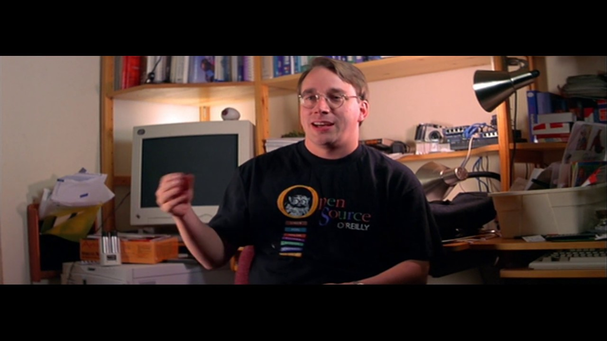

Revolution OS (2001)

https://www.imdb.com/title/tt0308808/

While Microsoft may be the biggest software company in the world, not every computer user is a fan of their products, or their way of doing business. While Microsoft&#39;s Windows became the most widely used operating system for personal computers in the world, many experts took issue with Microsoft&#39;s strict policies regarding licensing, ownership, distribution, and alteration of their software. The objections of many high-profile technology experts, most notably Richard Stallman, led to what has become known as &#34;the Open Source Movement,&#34; ...

* Duration: ca. 1 h 25 min.
* Language: en
* Type: Documentary
* Category: Culture / Society
* Tags: GNU/Linux, Open Source, History
* IMDb rating: [7.2 / 10 (2,709 votes)](https://www.imdb.com/title/tt0308808/)
* YouTube likes: 2,250
* Watch on: [YouTube](https://www.youtube.com/watch?v=k0RYQVkQmWU)
----
<h3 id="risk">Risk</h3>

What happens when radical transparency collides with state secrets? Risk is a gripping documentary by Laura Poitras that takes you inside the world of WikiLeaks, Julian Assange, and the global fight over information, power, and truth.

* Duration: ca. 1 h 31 min.
* Language: en
* Type: Documentary
* Category: Culture / People
* Tags: WikiLeaks, Whistleblowing, Privacy, Journalism
* YouTube likes: 947
* Watch on: [Netflix](https://www.netflix.com/title/80117236) | [YouTube](https://www.youtube.com/watch?v=mq9q3lOCJQ0)
----
<h3 id="ruby-on-rails-the-documentary">Ruby on Rails: The Documentary</h3>

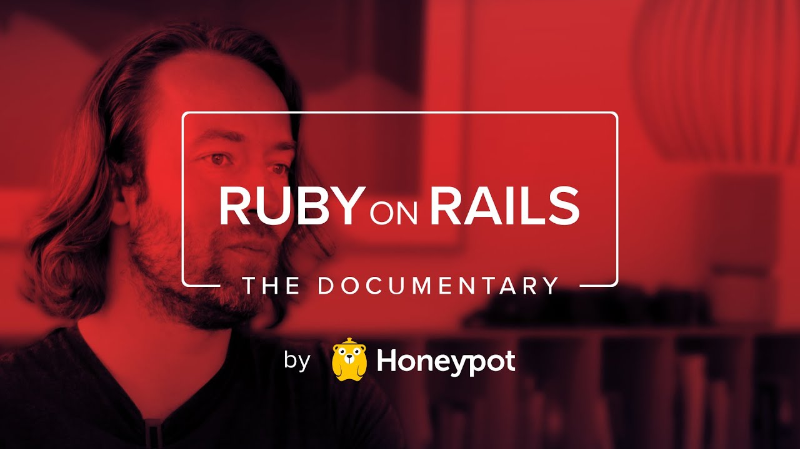

Ruby on Rails has one of the most faithful communities online, it also has one of the most controversial, rabble-rousing creators out there, Danish programmer, David Heinemeier Hansson. Widely known as DHH, David tells us how Rails went from a crazy idea to one of the most talked-about full-stack frameworks over the course of 20 years. 

Get the whole spill by the people who had a front-row seat to the creation and development of Ruby on Rails. Jeremy Daer, Jason Fried, Tobias Lütke, Jamis Buck, and… DHH tell the tale of Rails. A tale seeped with passion, pushback, and (after Rails 3.0) maturity. ...

* Duration: ca. 44 min.
* Language: en
* Type: Documentary
* Category: Applications / Frameworks / Systems
* Tags: Web Frameworks, Ruby, Open Source, History
* YouTube likes: 9,906
* Watch on: [YouTube](https://www.youtube.com/watch?v=HDKUEXBF3B4)
----
<h3 id="silicon-cowboys">Silicon Cowboys</h3>

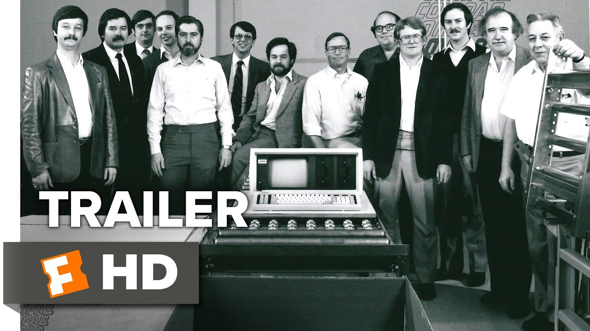

&#34;Silicon Cowboys&#34; chronicles the rise and fall of Compaq Computer Corporation, a pioneer in the early days of the personal computer industry. This engaging documentary takes viewers back to the 1980s, when a group of visionary engineers challenged the dominance of IBM and transformed the landscape of technology forever. Witness the birth, triumph, and eventual decline of one of the most influential companies in tech history.

* Type: Documentary
* Category: Culture / People
* Tags: Hardware, History, Personal Computing
* IMDb rating: [6.9 / 10 (2,242 votes)](https://www.imdb.com/title/tt4938484/)
* Watch on: [Netflix](https://www.netflix.com/title/80104318)
----
<h3 id="spring-the-documentary">Spring: The Documentary</h3>

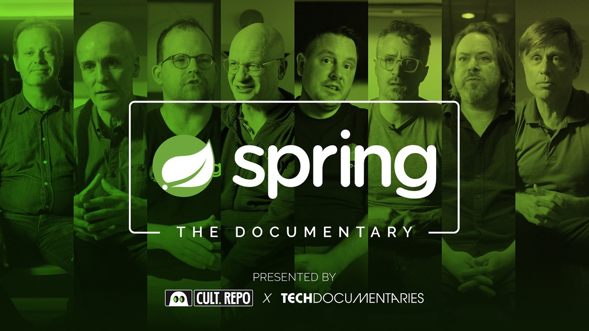

In the early 2000s, Java enterprise development had become a bureaucratic nightmare: a proliferation of untestable Java artefacts, heavyweight application servers, and ivory-tower standards disconnected from the realities of building software.

Then Rod Johnson published a book, included some code, and challenged the entire direction of enterprise Java.
Spring began as a developer-led push to take back control from ivory tower standards and was driven by a belief that building Java applications could be simple, testable, and grounded in real-world needs. Early Spring still used XML, but in a fundamentally ...

* Duration: ca. 35 min.
* Language: en
* Type: Documentary
* Category: Applications / Frameworks / Systems
* Tags: Web Frameworks, Java, Open Source, History
* YouTube likes: 2,057
* Watch on: [YouTube](https://www.youtube.com/watch?v=0Gb1z-2SjHY)
----
<h3 id="steal-this-film">Steal This Film</h3>

Steal This Film is part one of a series, documenting the movement against intellectual property produced by The League of Noble Peers and released via the BitTorrent peer-to-peer protocol.

* Duration: ca. 1 h 17 min.
* Language: en
* Type: Documentary
* Category: Culture / Society
* Tags: File Sharing, Copyright, BitTorrent, Internet Culture
* IMDb rating: [6.9 / 10 (491 votes)](https://www.imdb.com/title/tt1422757/)
* YouTube likes: 384
* Watch on: [YouTube](https://www.youtube.com/watch?v=YJ2Fh3tAD-I)
----
<h3 id="steve-jobs-the-man-in-the-machine">Steve Jobs: The Man in the Machine</h3>

A look at the personal and private life of the late Apple CEO, Steve Jobs.

* Duration: ca. 2 h 9 min.
* Language: en
* Type: Documentary
* Category: Culture / People
* Tags: Apple, Steve Jobs, History, Silicon Valley
* IMDb rating: [8.0 / 10 (18,587 votes)](https://www.imdb.com/title/tt3268458/)
* YouTube likes: 22
* Watch on: [Amazon Prime Video](https://www.amazon.de/gp/video/detail/amzn1.dv.gti.45bf1a90-eeb6-43aa-8ef2-0ecf4214f15d) | [Apple TV](https://tv.apple.com/de/movie/steve-jobs-the-man-in-the-machine/umc.cmc.23g7yoaqagwspdsdk2rnozy5) | [YouTube](https://www.youtube.com/watch?v=S4J9e7W68g4)
----
<h3 id="svelte-origins-a-javascript-documentary">Svelte Origins: A JavaScript Documentary</h3>

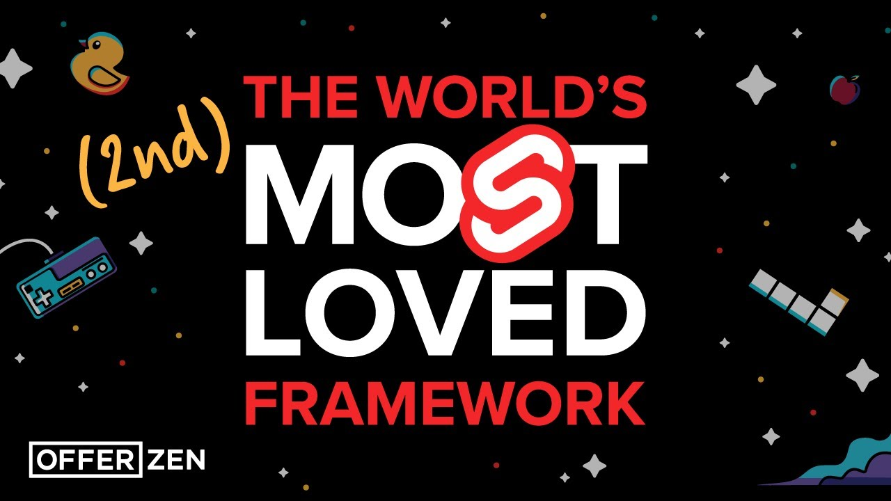

🎥 More tech documentaries coming out soon, subscribe to be notified 👉

(PS: The 2022 Stack Overflow Developer Survey results just came out and Phoenix overtook Svelte as the world&#39;s most loved web framework so hey, we had to adjust our thumbnail a bit 🤷)

Svelte Origins: The Documentary tells the story of how Svelte came to be, what makes Svelte different, and how it changes the game as a JavaScript framework. Filmed in locations throughout Europe and the US, it features Svelte’s creator Rich Harris and members from the core community who contributed to making Svelte what it is today.

Svelte Origins ...

* Duration: ca. 32 min.
* Language: en
* Type: Documentary
* Category: Applications / Frameworks / Systems
* Tags: Frontend, JavaScript, Open Source, History
* YouTube likes: 7,005
* Watch on: [YouTube](https://www.youtube.com/watch?v=kMlkCYL9qo0)
----
<h3 id="terminal-shop-the-documentary">Terminal.shop: The Documentary</h3>

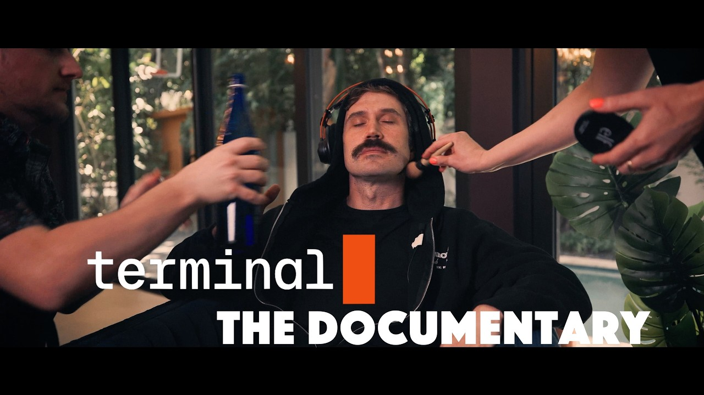

ssh http://terminal.shop 

💻 Videos to watch next:
▶ Lovable Mini Documentary | Behind The Code - https://youtu.be/1QhcGFA7qsQ
▶ Bolt.new Mini Documentary | Behind The Code - https://youtu.be/LfAV5fmRybg
▶ Nuxt.js Mini Documentary | Behind The Code - https://youtu.be/uvG11I-ftfo

👇 Learn more about Supabase 👇

🕸 Website: https://supabase.com/
🏁 Get started: https://app.supabase.com/
📄 Docs: https://supabase.com/docs

🔔 Subscribe for more tutorials and feature updates from Supabase: https://www.youtube.com/channel/UCNTVzV1InxHV-YR0fSajqPQ?sub_confirmation=1

📱 Connect with Us:
🐙 Github: https://www. ...

* Duration: ca. 11 min.
* Language: en
* Type: Documentary
* Category: Applications / Frameworks / Systems
* Tags: CLI, Terminal, Startups, Indie
* YouTube likes: 1,030
* Watch on: [YouTube](https://www.youtube.com/watch?v=3eH-WirT-5s)
----
<h3 id="terms-and-conditions-may-apply">Terms and Conditions May Apply</h3>

A documentary that exposes what corporations and governments learn about people through Internet and cell phone usage.

* Duration: ca. 1 h 20 min.
* Language: en
* Type: Documentary
* Category: Culture / Society
* Tags: Privacy, Surveillance, Internet
* IMDb rating: [7.3 / 10 (6,649 votes)](https://www.imdb.com/title/tt2084953/)
* YouTube likes: 617
* Watch on: [YouTube](https://www.youtube.com/watch?v=hRJEYmodC08)
----
<h3 id="the-cleaners">The Cleaners</h3>

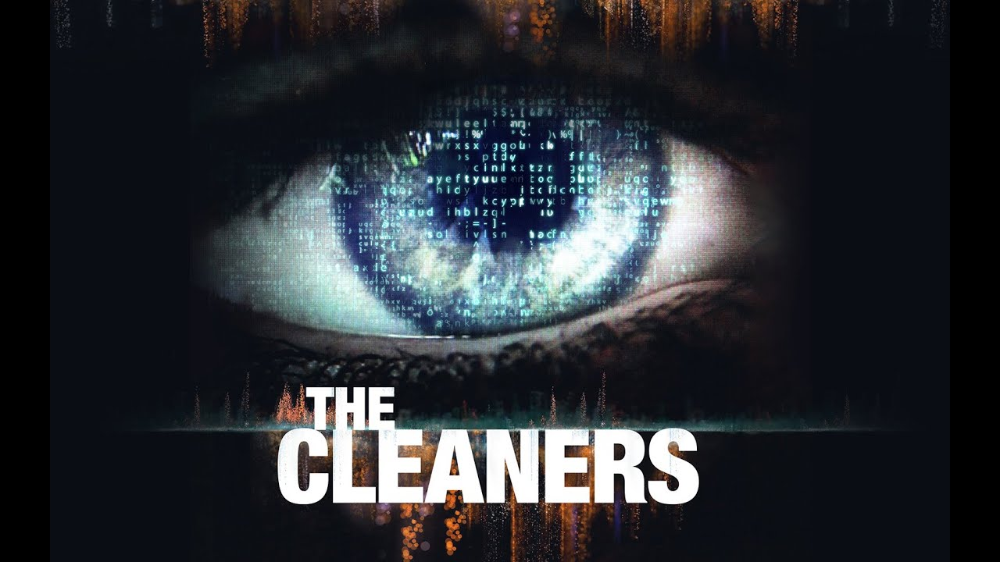

This documentary reveals the hidden world of content moderation on social media platforms. It examines the challenges faced by those responsible for keeping the internet free from harmful content and the ethical dilemmas that arise in the process.

* Type: Documentary
* Category: Culture / Society
* Tags: Content Moderation, Social Media, Ethics, Society
* IMDb rating: [7.1 / 10 (1,932 votes)](https://www.imdb.com/title/tt7689936/)
* Watch on: [Bundeszentrale für politische Bildung](https://www.bpb.de/mediathek/video/273199/the-cleaners/)
----
<h3 id="the-great-hack">The Great Hack</h3>

Explore how a data company named Cambridge Analytica came to symbolize the dark side of social media in the wake of the 2016 US presidential election.

* Language: en, de
* Type: Documentary
* Category: Culture / Society
* Tags: Privacy, Social Media, Politics, Data Analytics
* IMDb rating: [7.0 / 10 (25,863 votes)](https://www.imdb.com/title/tt4736550/)
* Watch on: [Netflix](https://www.netflix.com/title/80117542)
----
<h3 id="the-hacker-wars">The Hacker Wars</h3>

The Hacker Wars is an eye-opening documentary that reveals the high-stakes world of hacking, cyberwarfare, and digital activism. From underground hacker groups to government cyber defense teams, the film uncovers the real battles being fought in cyberspace - the rise of hacktivism and cyber resistance movements, how hackers exploit vulnerabilities to challenge powerful institutions, the blurred line between cybercrime and cyber defense, and why cybersecurity has become a global arms race.

* Duration: ca. 1 h 31 min.
* Language: en
* Type: Documentary
* Category: Culture / Society
* Tags: Hacktivism, Security, Anonymous, Whistleblowing
* YouTube likes: 1,072
* Watch on: [YouTube](https://www.youtube.com/watch?v=VPYci82ZzW0)
----
<h3 id="the-internets-own-boy-the-story-of-aaron-swartz">The Internet&#39;s Own Boy: The Story of Aaron Swartz</h3>

This is the FULL MOVIE! - The Internet&#39;s Own Boy depicts the life of American computer programmer, writer, political organizer and Internet activist Aaron Swartz. It features interviews with his family and friends as well as the internet luminaries who worked with him. The film tells his story up to his eventual suicide after a legal battle, and explores the questions of access to information and civil liberties that drove his work.
Director / Producer: Brian Knappenberger
Contact Information: http://www.takepart.com/internets-own-boy
This movie is made available under the Creative Commons license: ...

* Duration: ca. 1 h 45 min.
* Language: en
* Type: Documentary
* Category: Culture / People
* Tags: Hacktivism, Open Internet, Activism, History
* IMDb rating: [8.0 / 10 (18,587 votes)](https://www.imdb.com/title/tt3268458/)
* YouTube likes: 36,816
* Watch on: [YouTube](https://www.youtube.com/watch?v=9vz06QO3UkQ)
----
<h3 id="the-inventor-out-for-blood-in-silicon-valley">The Inventor: Out for Blood in Silicon Valley</h3>

The story of Theranos, a multi-billion dollar tech company, its founder Elizabeth Holmes, the youngest self-made female billionaire, and the massive fraud that collapsed the company.

* Language: en, de
* Type: Documentary
* Category: Culture / People
* Tags: Startups, Fraud, Silicon Valley, Health Tech
* IMDb rating: [7.2 / 10 (16,485 votes)](https://www.imdb.com/title/tt8488126/)
* Watch on: [Amazon Prime Video](https://www.amazon.de/gp/video/detail/amzn1.dv.gti.68c2a9a4-b9b2-4b6d-a7cb-8d1f2f6a1b11) | [HBO Max](https://play.hbomax.com/video/watch/60158ef5-c8c8-4d15-8d61-211d6e97e42c)
----
<h3 id="the-king-of-kong-a-fistful-of-quarters">The King of Kong: A Fistful of Quarters</h3>

Die-hard gamers compete to break world records on classic arcade games. A dedicated teacher attempts to break the world record for Donkey Kong, challenging the long-standing champion. This documentary explores the intense rivalries, precise strategies, and personal sacrifices involved in professional competitive gaming.

* Duration: ca. 1 h 23 min.
* Language: en, de
* Type: Documentary
* Category: Culture / People
* Tags: Gaming, Arcade, History, Competition
* IMDb rating: [8.0 / 10 (38,652 votes)](https://www.imdb.com/title/tt0923752/)
* YouTube likes: 4,989
* Watch on: [YouTube](https://www.youtube.com/watch?v=lXLQqcHcJDQ)
----
<h3 id="the-rise-of-uk-fintech">The Rise of UK Fintech</h3>

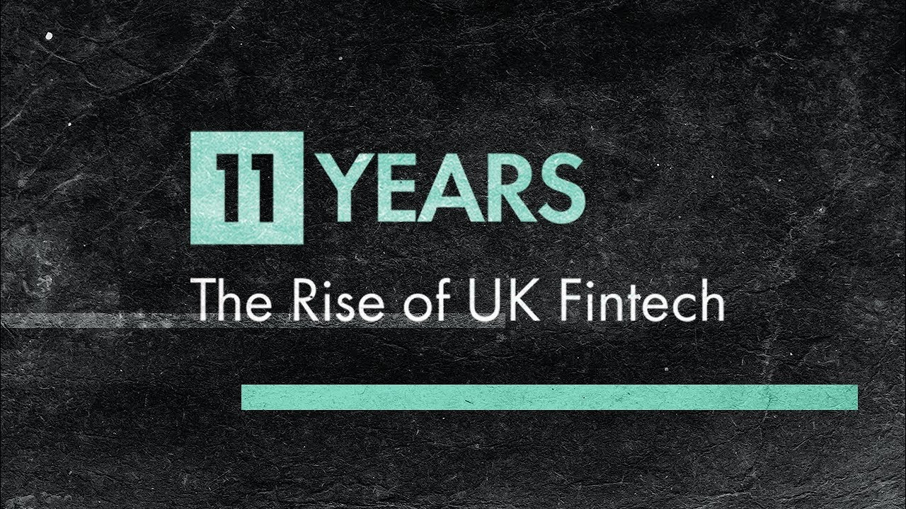

The Rise of UK Fintech is a documentary that explores how the UK created a thriving fintech ecosystem from the ashes of the 2008 financial crisis. Hear from the founders and CEOs of the UK&#39;s biggest fintechs such as Monzo, Starling, Revolut, OakNorth, as well as leaders from the FCA, Bank of England, and more. The 2008 financial crisis brought so many countries in the world to the edge of insolvency, but the UK saw this as a chance for reform, and completely overhauled its banking sector to create one of the most enviable fintech ecosystems in the world.

* Duration: ca. 58 min.
* Language: en
* Type: Documentary
* Category: Culture / Society
* Tags: Fintech, Startups, Banking, Regulation
* YouTube likes: 1,368
* Watch on: [YouTube](https://www.youtube.com/watch?v=59erwsHe5CI)
----
<h3 id="the-social-dilemma">The Social Dilemma</h3>

The Social Dilemma is a powerful exploration of the disproportionate impact that a relatively small number of engineers in Silicon Valley have over the way we think, act, and live our lives. The film deftly tackles an underlying cause of viral conspiracy theories, teenage mental health issues, rampant misinformation and political polarization. Through a combination of documentary investigation and narrative drama, the filmmakers expose the hidden machinations behind everyone&#39;s favorite social media and search platforms, featuring interviews with high-profile tech whistleblowers including Tristan ...

* Language: en, de
* Type: Documentary
* Category: Culture / Society
* Tags: Social Media, Privacy, Society, Ethics
* IMDb rating: [7.6 / 10 (94,682 votes)](https://www.imdb.com/title/tt11464826/)
* Watch on: [Netflix](https://www.netflix.com/title/81254224)
----
<h3 id="the-story-of-c">The Story of C&#43;&#43;</h3>

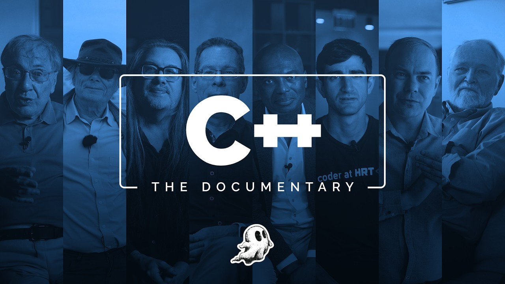

This is the story of C&#43;&#43;, one of the world’s most widely-used and consequential programming languages. C&#43;&#43;  divides opinion, resists replacement, and has outlasted almost everything built to supersede it. 

C&#43;&#43; The Documentary traces the full arc, from its origins in the corridors of Bell Labs to the global community that shapes it today.

Featuring the people who built it, extended it, argued over it, and refused to let it die.

Bjarne Stroustrup: Bell Labs, Designer and original implementer of C&#43;&#43; 
Alexander Stepanov: Designer of the Standard Template Library 
Anders Hejlsberg: Creator of C#, ...

* Duration: ca. 1 h 12 min.
* Language: en
* Type: Documentary
* Category: Programming Languages
* Tags: Programming Languages, C&#43;&#43;, History
* YouTube likes: 11,213
* Watch on: [YouTube](https://www.youtube.com/watch?v=lI7tMxzSJ7w)
----
<h3 id="tpb-afk-the-pirate-bay-away-from-keyboard">TPB AFK: The Pirate Bay Away From Keyboard</h3>

The documentary about the founders of The Pirate Bay. An intellectual freedoms documentary based around the interpersonal triumphs and defeats of the three main characters against the largest industry in the known universe - the media industry.

* Duration: ca. 1 h 22 min.
* Language: en
* Type: Documentary
* Category: Culture / People
* Tags: File Sharing, Open Source, Internet Freedom, History
* IMDb rating: [7.4 / 10 (14,222 votes)](https://www.imdb.com/title/tt2608732/)
* YouTube likes: 536
* Watch on: [YouTube](https://www.youtube.com/watch?v=ui-w6ZUCzj8)
----
<h3 id="typescript-origins-the-documentary">TypeScript Origins: The Documentary</h3>

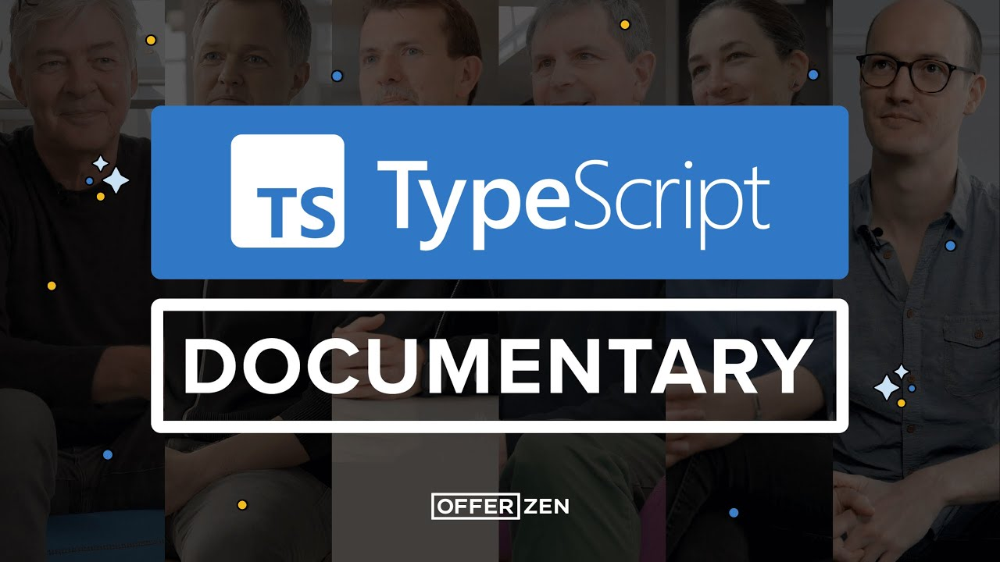

TypeScript Origins: The Documentary is brought to you by OfferZen - the community-first developer jobs platform. The documentary features core contributors and community members like Anders Hejlsberg, Steve Lucco, Luke Hoban, Daniel Rosenwasser, Ryan Cavanaugh, Amanda Silver, Matt Pocock, Josh Goldberg &amp; many more!

It also covers adoption stories and insights from JetBrains, Xata, AG_Grid, Deno, Visual Studio Code and Tech at Bloomberg.

#typescript #javascript #programming #softwaredevelopment 

Sponsored by 
- JetBrains (www.jetbrains.com)
- BBD (www.bbd.co.za)
- AG Grid (www.ag-grid.com)
- ...

* Duration: ca. 1 h 22 min.
* Language: en
* Type: Documentary
* Category: Programming Languages
* Tags: Programming Languages, JavaScript, Microsoft, History
* YouTube likes: 9,618
* Watch on: [YouTube](https://www.youtube.com/watch?v=U6s2pdxebSo)
----
<h3 id="ulterior-states">Ulterior States</h3>

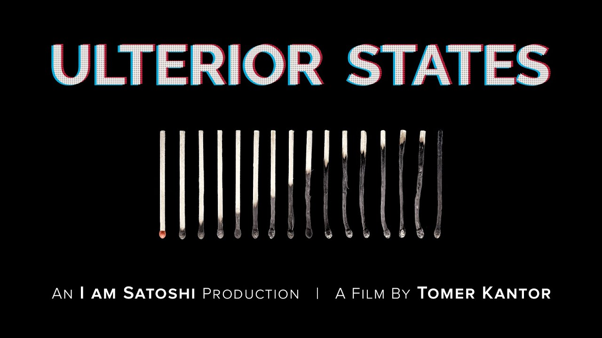

Ulterior States (2015) is a self-funded documentary by Free Software developer Dyne.org exploring the decentralized cryptocurrency culture from 2012-2015, highlighting code as activism, digital currency, and future community-governed micro-states. The film collages, rather than dictates, a vision of the emerging crypto landscape.

* Duration: ca. 53 min.
* Language: en
* Type: Documentary
* Category: Culture / Society
* Tags: Cryptocurrency, Open Source, Decentralization, Activism
* YouTube likes: 1,356
* Watch on: [YouTube](https://www.youtube.com/watch?v=yQGQXy0RIIo)
----
<h3 id="vite-the-documentary">VITE: The Documentary</h3>

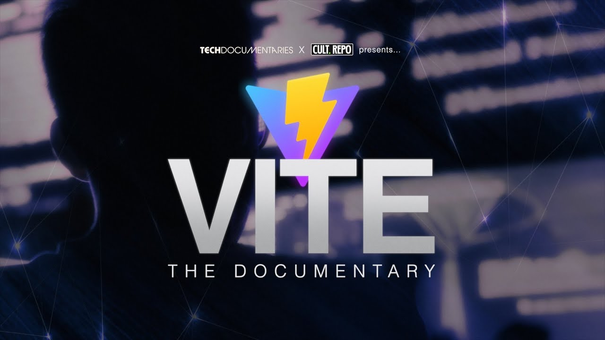

&#34;If you&#39;re using a JavaScript framework, you&#39;re probably using Vite.&#34;

Created by Evan You (the mind behind Vue.js), Vite began as a frustrated response to slow build times with Webpack. What started as a personal side project for Vue users quickly grew into a framework-agnostic ecosystem embraced by React, Svelte, Astro, Remix, and more. Along the way, it sparked rivalries, rewrites, and community-driven breakthroughs that changed the frontend landscape forever.

Featuring many prominent developers in the JavaCript ecosystem, this documentary dives into the innovation, competition, and collaboration ...

* Duration: ca. 39 min.
* Language: en
* Type: Documentary
* Category: Applications / Frameworks / Systems
* Tags: Frontend, Build Tools, JavaScript, Open Source
* YouTube likes: 6,010
* Watch on: [YouTube](https://www.youtube.com/watch?v=bmWQqAKLgT4)
----
<h3 id="vue-js-the-documentary">Vue.js: The Documentary</h3>

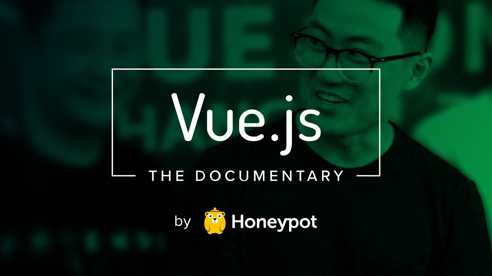

by honeypot.io | What began as a side project of a Google developer
now shares the JS leaderboard with #React and #Angular...
With the help of Sarah Drasner, Taylor Otwell, Thorsten Lünborg and many others from the Vue.js community, Evan You tells the story of how he fought against the odds to bring #Vuejs to life.

Check out the home for untold developer stories around open source, careers and all the other cool stuff developers are doing at https://bit.ly/3FGSlim

Honeypot is a developer-focused job platform, on a mission to get every developer a great job. Wanna see what we&#39;re all about? Check ...

* Duration: ca. 35 min.
* Language: en
* Type: Documentary
* Category: Applications / Frameworks / Systems
* Tags: Frontend, JavaScript, Open Source, History
* YouTube likes: 52,883
* Watch on: [YouTube](https://www.youtube.com/watch?v=OrxmtDw4pVI)
----
<h3 id="we-are-legion-the-story-of-the-hacktivists">We Are Legion: The Story of the Hacktivists</h3>

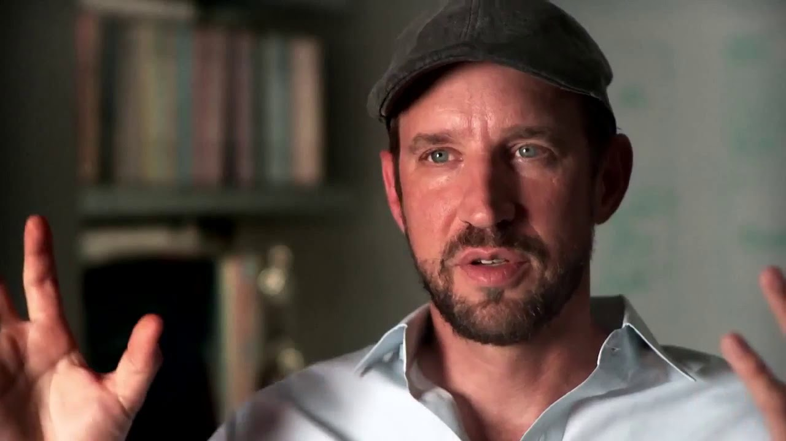

This documentary takes a deep dive into the world of Anonymous, a loosely organized international group of hacktivists. It offers a fascinating look at the power and influence of hacker culture in the digital age.

* Duration: ca. 1 h 37 min.
* Language: en
* Type: Documentary
* Category: Culture / Society
* Tags: Anonymous, Hacktivism, Security, History
* IMDb rating: [7.2 / 10 (10,545 votes)](https://www.imdb.com/title/tt2177843/)
* YouTube likes: 1,060
* Watch on: [YouTube](https://www.youtube.com/watch?v=4D1WJsdu6W8)
----
<h3 id="we-live-in-public">We Live in Public</h3>

We Live In Public is a 2009 documentary film by Ondi Timoner about Internet pioneer Josh Harris, indirectly highlighting the loss of privacy in the Internet age.

* Type: Documentary
* Category: Culture / Society
* Tags: Internet, Privacy, Society, History
* IMDb rating: [6.3 / 10 (243 votes)](https://www.imdb.com/title/tt1326201/)
* Watch on: [Amazon Prime Video](https://www.primevideo.com/-/de/detail/We-Live-In-Public/0U7M85IDXG9VFNCL3YF9E0N5VP)
----
<h3 id="we-steal-secrets-the-story-of-wikileaks">We Steal Secrets: The Story of WikiLeaks</h3>

A documentary that details the creation of Julian Assange&#39;s controversial website, which facilitated the largest security breach in U.S. history.

* Duration: ca. 2 h 10 min.
* Language: en, de
* Type: Documentary
* Category: Culture / Society
* Tags: WikiLeaks, Whistleblowing, Security, Journalism
* IMDb rating: [7.8 / 10 (78 votes)](https://www.imdb.com/title/tt2391809/)
* YouTube likes: 18
* Watch on: [Amazon Prime Video](https://www.amazon.de/gp/video/detail/amzn1.dv.gti.eca9f6cb-646d-7bdf-fe60-44b2f2f57933) | [YouTube](https://www.youtube.com/watch?v=Qhn_3WNhxEc)
----
<h3 id="zero-days">Zero Days</h3>

A documentary focused on Stuxnet, a self-replicating computer virus discovered in 2010 to be undermining Iran&#39;s nuclear program, and the men and women who tried to contain its fallout.

* Duration: ca. 1 h 54 min.
* Language: en, de
* Type: Documentary
* Category: Culture / Society
* Tags: Security, Cyberwarfare, Stuxnet, Politics
* IMDb rating: [7.7 / 10 (11,057 votes)](https://www.imdb.com/title/tt5446858/)
* YouTube likes: 47
* Watch on: [Amazon Prime Video](https://www.amazon.de/gp/video/detail/amzn1.dv.gti.faab71cc-b891-ac52-2485-42fbcf36405f) | [Apple TV](https://tv.apple.com/de/movie/zero-days---world-war-30/umc.cmc.4oquioo4lz0w050igaffx92ri) | [YouTube](https://www.youtube.com/watch?v=F8l_eIGU_H8)
----

## Movies

<h3 id="23">23</h3>

Nineteen-year-old Karl is fascinated by the fictional character Hagbard Celine and sets out to uncover the inner workings of political mechanisms. He discovers things that lead him to believe in a conspiracy. Karl&#39;s talent for hacking into global data networks and his unshakeable belief in justice drive him into the arms of the KGB. He loses control.

* Duration: ca. 1 h 39 min.
* Language: en, de
* Type: Movie
* Category: Hollywood style
* Tags: Hacking, History, Conspiracy, Cold War
* IMDb rating: [7.1 / 10 (7,838 votes)](https://www.imdb.com/title/tt0126765/)
* YouTube likes: 70
* Watch on: [Amazon Prime Video](https://www.amazon.de/gp/video/detail/amzn1.dv.gti.3e7449a8-4bd6-409b-a1b0-56fc2762b43c) | [Apple TV](https://tv.apple.com/de/movie/23/umc.cmc.1n7aar1t57m6rndfhm9u6vixo) | [YouTube](https://www.youtube.com/watch?v=e2DCvHZGGH4)
----
<h3 id="hidden-figures">Hidden Figures</h3>

&#34;Hidden Figures&#34; is the incredible, untold story of Katherine Johnson, Dorothy Vaughan, and Mary Jackson. It is a passionate tribute to three extraordinary African American women who worked at NASA in the early 1960s and played a leading role in one of the most significant events in recent history. These brilliant mathematicians are part of the team that enables the first U.S. astronaut, John Glenn, to orbit the Earth. A breathtaking achievement that gives the American nation new self-confidence, redefines the space race, and stirs the world. In doing so, the visionary trio fights to overcome gender ...

* Duration: ca. 2 h 7 min.
* Language: en, de
* Type: Movie
* Category: Hollywood style
* Tags: NASA, History, Mathematics, Diversity
* IMDb rating: [7.8 / 10 (291,385 votes)](https://www.imdb.com/title/tt4846340/)
* YouTube likes: 979
* Watch on: [Amazon Prime Video](https://www.amazon.de/gp/video/detail/amzn1.dv.gti.8ab8c01b-a530-5865-60bc-eeedf40e97b4) | [Apple TV](https://tv.apple.com/de/movie/hidden-figures---unerkannte-heldinnen/umc.cmc.4io2m0zk1cs9g1olb2hduzu6z) | [YouTube](https://www.youtube.com/watch?v=bvAbdZbHmhY)
----
<h3 id="pirates-of-silicon-valley">Pirates of Silicon Valley</h3>

On the cusp of the digital age, visionary geniuses Bill Gates and Steve Jobs launch the revolutionary race between rivals Microsoft and Apple Computer. From late-night tinkering sessions in the dorm to days spent strategizing in the boardroom - their fierce and often humorous battle to dominate the fledgling computer industry gives rise to a new technology that literally changes the world. Based on the book *Fire in the Valley* by Paul Freiberger and Michael Swaine.

* Language: en, de
* Type: Movie
* Category: Hollywood style
* Tags: Apple, Microsoft, History, Startups
* IMDb rating: [7.2 / 10 (26,231 votes)](https://www.imdb.com/title/tt0168122/)
* Watch on: [Amazon Prime Video](https://www.amazon.de/gp/video/detail/amzn1.dv.gti.a6ad7e6d-dcf5-32fa-e147-1589b9f9ec4a)
----
<h3 id="snowden">Snowden</h3>

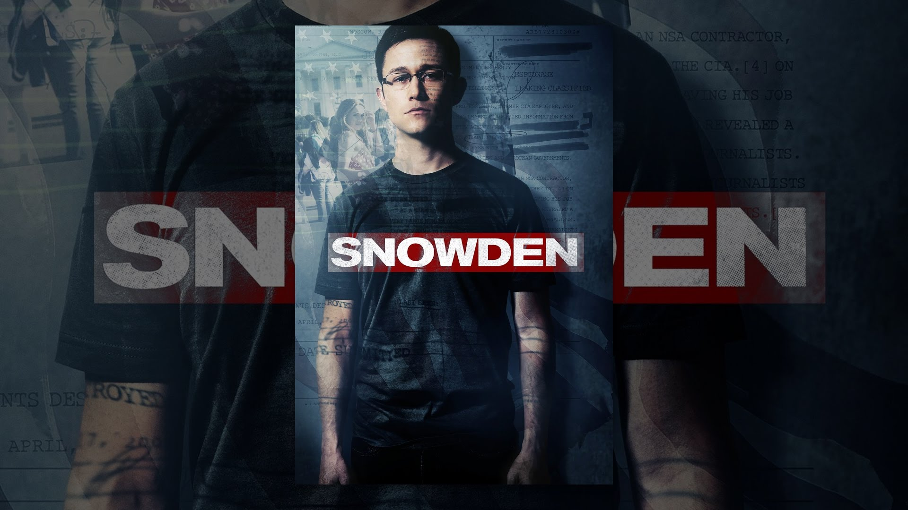

Traitor or hero. What would you do if you knew your government was abusing the power entrusted to it? How far would your resistance go? What sacrifices would you be willing to make? Snowden, the international thriller from Oscar® winner Oliver Stone, brings the life of the controversial whistleblower Edward Snowden to the big screen. The story of an ordinary man who could not reconcile his conscience with remaining silent...

* Duration: ca. 2 h 15 min.
* Language: en, de
* Type: Movie
* Category: Hollywood style
* Tags: Surveillance, Privacy, Whistleblowing, NSA
* IMDb rating: [7.3 / 10 (173,336 votes)](https://www.imdb.com/title/tt3774114/)
* YouTube likes: 639
* Watch on: [Amazon Prime Video](https://www.amazon.de/gp/video/detail/amzn1.dv.gti.2088b418-e12c-4a0d-b569-8542561d890d) | [Apple TV](https://tv.apple.com/de/movie/snowden/umc.cmc.3j73epo0sky4mob3jog0xxw5r) | [YouTube](https://www.youtube.com/watch?v=0l78qbhP3QU)
----
<h3 id="steve-jobs">Steve Jobs</h3>

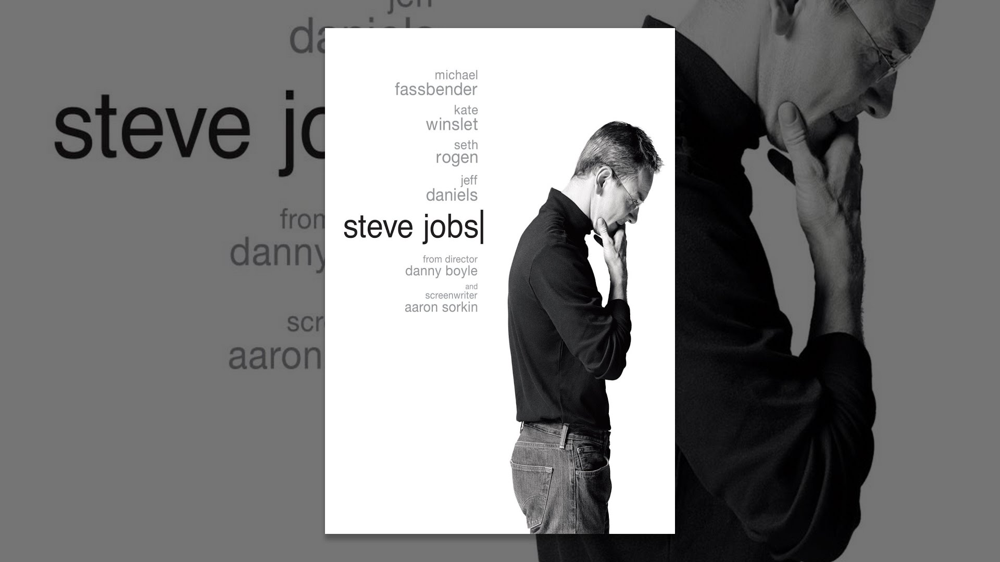

&#34;Steve Jobs&#34; is an authentic biopic about the man behind the digital revolution. The film reveals what went on behind the scenes in the days leading up to the Apple CEO&#39;s most significant product launches. A compelling portrayal that shows the unique visionary from a side never seen before! Written by Oscar® winner Aaron Sorkin (&#34;The Social Network&#34;) and directed by Oscar® winner Danny Boyle (&#34;Slumdog Millionaire&#34;), the drama shines with an impressive star-studded cast, including: Michael Fassbender, Kate Winslet, Seth Rogen, and Jeff Daniels.

* Duration: ca. 2 h 3 min.
* Language: en, de
* Type: Movie
* Category: Hollywood style
* Tags: Apple, Biopic, Product Launches
* IMDb rating: [7.2 / 10 (187,736 votes)](https://www.imdb.com/title/tt2080374/)
* YouTube likes: 293
* Watch on: [Amazon Prime Video](https://www.amazon.de/gp/video/detail/amzn1.dv.gti.08a9f70b-7712-cd47-4e13-d0e9613e58dd) | [Apple TV](https://tv.apple.com/de/movie/steve-jobs/umc.cmc.20qugmesej4yg33x3e4uev8xh) | [YouTube](https://www.youtube.com/watch?v=wPqfVEOCIqE)
----
<h3 id="the-imitation-game">The Imitation Game</h3>

The Enigma is giving researchers a headache: the German coding machine encrypts the radio messages of the Wehrmacht and the Navy. Mathematicians and other researchers at Bletchley Park in Britain are working around the clock to crack the German code. Finally, a young genius, Alan Turing (Benedict Cumberbatch), achieves a breakthrough - from then on, the German radio messages are no longer a secret to the Allies. Now, however, the task is to make this breakthrough the country&#39;s best-kept secret. Only in this way can the Germans be prevented from deploying a new encryption system. Turing becomes ...

* Duration: ca. 1 h 50 min.
* Language: en, de
* Type: Movie
* Category: Hollywood style
* Tags: Cryptography, History, WWII, Alan Turing
* IMDb rating: [8.0 / 10 (880,975 votes)](https://www.imdb.com/title/tt2084970/)
* YouTube likes: 681
* Watch on: [Amazon Prime Video](https://www.amazon.de/gp/video/detail/amzn1.dv.gti.9ea9f6d8-dcfc-e49d-ffea-c3f92245045d) | [Apple TV](https://tv.apple.com/de/movie/the-imitation-game---ein-streng-geheimes-leben/umc.cmc.59i1cp4fboyedvyq6zlx3bymd) | [YouTube](https://www.youtube.com/watch?v=Kauqv7p-8b4)
----
<h3 id="underground-the-julian-assange-story">Underground: The Julian Assange Story</h3>

Julian Assange became a legend in his own lifetime for making highly sensitive classified information available to the entire world. But what does the world really know about him? Underground: The Julian Assange Story traces the early days of the WikiLeaks founder. This fascinating film is based on Suelette Dreyfus&#39;s 1997 book about a community of computer hackers. It sheds light on what kind of person Julian Assange is. It depicts his arrest for hacking into a Canadian telephone company. Particularly striking are his early days as a hacker, breaking into the Pentagon, the U.S. Army, and NASA. ...

* Duration: ca. 1 h 34 min.
* Language: en, de
* Type: Movie
* Category: Hollywood style
* Tags: Hacking, WikiLeaks, Biopic, History
* IMDb rating: [6.7 / 10 (2,144 votes)](https://www.imdb.com/title/tt2357453/)
* YouTube likes: 4
* Watch on: [Amazon Prime Video](https://www.amazon.de/gp/video/detail/amzn1.dv.gti.62a9f6d2-5a7c-57e0-e99b-dd258248554c) | [YouTube](https://www.youtube.com/watch?v=b5z86SpPHU0)
----

## How to contribute

If you want to
* add a new entry to the list, check out our [Contribution Guide](/CONTRIBUTING.md)
* modify the tooling and structure, check out our [Development Guide](/DEVELOPMENT.md)

## Projects like us

We are not alone — these sibling lists sometimes uncover true gems:

* [k4m4/movies-for-hackers](https://github.com/k4m4/movies-for-hackers) — 🎬 A curated list of movies every hacker & cyberpunk must watch.
* [greybax/awesome-IT-films](https://github.com/greybax/awesome-IT-films) — 📺 A curated list of awesome films about IT & geek people.

